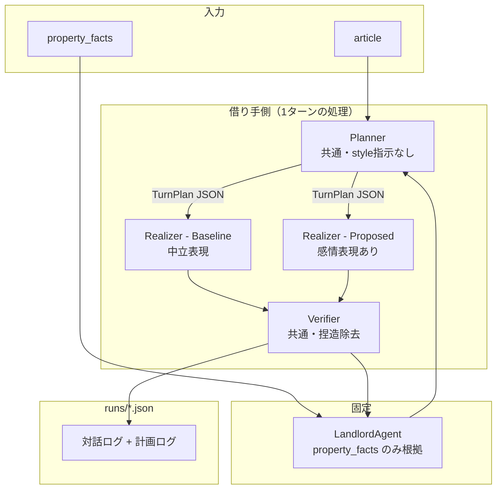

# 借り手AIエージェント実験システム 設計書

| 項目 | 内容 |
|---|---|
| 版 | v1.0（旧 v0.5 相当。バージョン分割後の固定感情表現版） |
| 更新 | 2026-07-15 |
| 関連 | `研究方針.md`, `../README.md` |

---

## 1. 目的

逆さま不動産の文脈で、**借り手の記事に基づき大家と多ターン対話する借り手AIエージェント**を試作する。本システムは本番サービスではなく、次の研究仮説を検証するための **対話実験基盤** である。

> **感情表現の指示を与えない（Baseline）より、与える（Proposed）方が、借り手の熱意・動機を大家に届ける対話品質が高くなるか。**

### 1.1 研究フレーム

対象とする大家は**貸すことには消極的だが場合によっては貸してもよいと思っている**層。その物件に対して複数の借り手エージェントがそれぞれ独立に熱意をアピールしながら対話する（**1対多の構図**）。

借り手AIは次の2つの機能を担う。研究として最も注力するのは**感情表現**である。

1. **感情表現（主）**：借り手の夢・目的・想いを短く・率直に大家に届け、「この人に貸したい」と感じさせる
2. **適合確認の質問（従）**：借り手の目的に照らして物件が適しているかを確認する

実験では1対1の対話として実施するが、これは1対多の構図における個々の対話を模したものである。

### 1.2 スコープ内

- 借り手記事に基づく多ターン対話の自動生成
- 借り手側の2条件（Baseline / Proposed）の比較
- 大家側は物件ファクトに grounding した LLM（全条件で同一）
- 対話ログの JSON 保存（計画ログ含む）と人手評価のためのメタデータ

### 1.3 スコープ外

- 逆さま不動産プラットフォームとの本番連携
- Web UI・認証・DB
- LLM-as-judge による自動評価の本格運用
- PPO・MCTS・DPO などの学習ベース手法の再現

---

## 2. システムの全体像

### 2.1 一言で

**共通の Planner と Verifier を持ち、Realizer の style だけを条件間で変える実験装置。**

### 2.2 登場人物

| 役 | 実装 | 実験での扱い |
|---|---|---|
| **Planner** | LLM + `planner.txt` | **両条件で共通**。発話前に計画JSONを生成する |
| **Realizer（借り手AI）** | LLM + `realizer_{condition}.txt` | **比較対象**（Baseline vs Proposed）。styleのみ異なる |
| **Verifier** | LLM + `verifier.txt` | **両条件で共通**。発話後に捏造を除去する |
| **大家LLM** | LLM + `landlord.txt` | **全条件で固定** |
| **借り手記事** | YAML `article` | 両条件の根拠（記事全文） |
| **物件ファクト** | YAML `property_facts` | 大家が答えてよい事実の上限（完全架空・研究者作成） |

### 2.3 なぜ Planner を両条件で共通にするか

Planner を共通化することで、**独立変数を感情表現の style 指示のみ**に絞れる。

Planner がない設計では「計画の違い」と「表現の違い」が混ざり、Proposed が良い結果になっても何が効いたか特定できない。共通 Planner により「同じ計画から style だけ変えた」と言い切れる。

### 2.4 なぜ Verifier を両条件で共通にするか

感情表現の指示を強めるほど LLM は記事にない事実を補完しやすい。Verifier を共通化することで、「感情表現が良かったのか・捏造が良かったのか」の混同を防ぐ。

### 2.5 ブロック図



---

## 3. 対話フロー

### 3.1 1ターンの処理順序

```
大家の発話
  ↓
[Step 1] Planner（共通）
  → 対話履歴を見て TurnPlan JSON を生成
  → { turn_goal, phase, evidence_summary, ask_slot, owner_concern }

  ↓
[Step 2] Realizer（条件別）
  → 同じ TurnPlan JSON を受け取り、条件別 style で発話を生成
  → Baseline: 中立表現 / Proposed: 感情表現（phase 別）

  ↓
[Step 3] Verifier（共通）
  → 記事に根拠のない主張を削除・弱める

  ↓
借り手の発話（ログに TurnPlan 付き）

  ↓
大家LLM が property_facts の範囲で応答
```

### 3.2 ターン順序

1. **大家** が最初の挨拶を発話（`opening` 固定文）
2. **Step 1〜3** を `max_turns=4`（デフォルト）まで繰り返す
3. ログを `runs/` に JSON 保存

ターン数は `--max-turns` で変更可能。この対話は条件交渉ではなく「借り手の想いを聞く場」であるため、3〜4ターンで自然に完結する。

### 3.3 TurnPlan の構造

```json
{
  "turn_goal": "appeal | ask_fit_question | empathize | reassure | close",
  "phase": "opening | middle | closing",
  "evidence_summary": "今ターンで使う借り手情報の要約（1〜2文）",
  "ask_slot": "今ターンで確認する物件情報のキーワード（なければ null）",
  "owner_concern": "unknown | cost | renovation | duration | other"
}
```

---

## 4. 実験条件（比較設計）

### 4.1 変えるもの（独立変数）

| 条件 ID | Planner | Realizer style | Verifier |
|---|---|---|---|
| `baseline` | 共通 | 中立（感情表現指示なし） | 共通 |
| `proposed` | 共通 | 感情あり（phase 別の感情表現指示） | 共通 |

**Planner と Verifier は両条件で完全に同一。** Realizer の style 指示のみが独立変数。

### 4.2 固定するもの（統制変数）

| 項目 | 固定内容 |
|---|---|
| LLM モデル | `claude-haiku-4-5`、`temperature=0`（全コンポーネント） |
| 大家 system prompt | `prompts/landlord.txt` 共通 |
| `property_facts` | ケースごとに同一（条件間で共有） |
| `opening` | 大家の初回発話（YAML に固定文を記載） |
| ケース ID | 同一 YAML で2条件を実行 |

---

## 5. データ設計

### 5.1 ケースファイル `../shared/data/eval_cases/{case_id}.yaml`

```yaml
id: case01_ceramic_atelier
title: 陶作家のアトリエ兼住居を探す借り手
article: |
  （借り手が逆さま不動産に公開している記事全文）
meta:
  domain: reverse_real_estate
  source_url: https://...
  profile_created_by: llm_assisted
```

`article` のみを入力とする。構造化プロファイル（profile/slots）は Planner が実行時に動的に解釈する。

### 5.2 物件ファイル `../shared/data/properties/{property_id}.yaml`

```yaml
id: property01_kuwana
title: 桑名市の空き家
property_facts:
  area: "約120㎡"
  smoke_stack: "設置可能（要事前確認）"
  ...
opening: "こんにちは。どのような使い方をお考えですか？"
meta:
  target_case: case01_ceramic_atelier
```

### 5.3 ログ出力 `runs/{case_id}_{property_id}_{condition}_{timestamp}.json`

```json
{
  "case_id": "case01_ceramic_atelier",
  "property_id": "property01_kuwana",
  "condition": "baseline",
  "model_borrower": "claude-haiku-4-5",
  "model_landlord": "claude-haiku-4-5",
  "temperature": 0,
  "max_turns": 6,
  "turns": [
    {"role": "landlord", "content": "こんにちは。どのような使い方をお考えですか？"},
    {
      "role": "borrower",
      "content": "アトリエ兼住居として使いたいと考えています。",
      "plan": {
        "turn_goal": "appeal",
        "phase": "opening",
        "evidence_summary": "陶作家として落ち着いた制作環境を求めている",
        "ask_slot": "smoke_stack",
        "owner_concern": "unknown"
      }
    },
    {"role": "landlord", "content": "煙突は設置可能です。"}
  ]
}
```

---

## 6. コンポーネント設計

### 6.1 ディレクトリ

```
borrower_agent/
├── shared/                 # バージョン共通
│   ├── data/
│   │   ├── eval_cases/     # 実験対象ケース YAML
│   │   ├── cases/          # 全借り手記事 YAML
│   │   └── properties/     # 物件 YAML
│   └── eval/
│       ├── rubric.md
│       └── scores.csv
├── v1_fixed_emotion/       # 本版（感情表現をphase固定で付与）
│   ├── src/
│   │   ├── models.py
│   │   ├── llm_client.py
│   │   ├── planner.py
│   │   ├── verifier.py
│   │   ├── borrower_policy.py
│   │   ├── landlord_agent.py
│   │   └── dialogue_runner.py
│   ├── prompts/
│   ├── scripts/
│   │   └── run_experiment.py
│   └── runs/
└── v2_adaptive_planner/    # 別版（状況に応じて何を・どれだけ言うかを動的決定）
```

ケース・物件データは `../shared/data/` を参照する（バージョン間で入力を揃えるため）。
### 6.2 モジュール責務

| モジュール | 責務 |
|---|---|
| `models.py` | データ構造のみ。ロジックなし |
| `llm_client.py` | API 呼び出しの低レベルラッパー。`call_llm`（履歴付き）と `call_llm_single`（単発）の2関数 |
| `planner.py` | 対話履歴テキスト → TurnPlan JSON。両条件共通 |
| `verifier.py` | 生成発話 + 記事 → 検証済み発話。両条件共通 |
| `borrower_policy.py` | `build_system_prompt(case, condition, plan)` → 条件別 system prompt（毎ターン plan を注入） |
| `landlord_agent.py` | `build_system_prompt(prop)` → 物件ファクト付き大家プロンプト |
| `dialogue_runner.py` | Planner → Realizer → Verifier のオーケストレーション。ログ保存 |

### 6.3 call_llm のロールマッピング

`call_llm(system, history, caller_role)`:
- `caller_role` の過去発話 → `"assistant"`
- 相手の発話 → `"user"`
- 先頭が `"assistant"` の場合は除去（Anthropic API の制約）

`call_llm_single(system, user_message)`:
- Planner・Verifier 専用。履歴なしの単発呼び出し

---

## 7. プロンプト方針

### 7.1 `prompts/planner.txt`

- style 指示を持たない（中立な計画器）
- **感情表現（主）・適合確認の質問（従）** の優先順位を明示
- `ask_slot` は全6ターン中2〜3回まで。使用イメージを伝えるための質問に限る
- 対話履歴テキストと「今ターンの計画をJSONで出力してください」をユーザーメッセージとして受け取る
- **JSON のみ出力**。説明文不要

### 7.2 `prompts/realizer_baseline.txt`

- `{article}` と `{plan_json}` を埋め込む
- 感情表現・継続性・共感に関する指示を**一切含めない**
- 「事実と目的を中心に、必要事項を過不足なく伝える」のみ

### 7.3 `prompts/realizer_proposed.txt`

- `{article}` と `{plan_json}` を埋め込む（Baseline と同じ入力）
- **phase 別の感情表現ガイドを追加**：
  - `opening`：動機・想いを1文で率直に伝える
  - `middle`：大家の懸念を受け止めてから質問する
  - `closing`：前向きな姿勢を示しつつ残りの確認をする

### 7.4 `prompts/verifier.txt`

- `{article}` を埋め込む
- 根拠のない断定 → 削除または推測表現に変更
- 修正後の発話のみ出力（説明文不要）

### 7.5 `prompts/landlord.txt`

- `{property_facts}` を埋め込む（直接聞かれたときのみ参照）
- **`{article}` は渡さない**。大家はこの対話の時点で借り手の記事を読んでいない前提
- **借り手から大家に連絡してくる**。大家は受動的に話を聞く立場
- この場の目的は「借り手の話を聞いて貸したいか判断すること」。契約条件の提示・交渉は行わない
- 家賃・契約期間・契約条件はこちらから提示しない。聞かれても「実際に会って相談しましょう」と返す
- 積極的な歓迎・勧誘をしない（消極的スタンス）

---

## 8. 評価設計

### 8.1 評価軸

この対話の目的は「大家に貸したいと感じてもらうこと」であり、条件のすり合わせは対面後に行う。評価軸もこの優先順位を反映する。

**主指標（研究の主眼）:**

| 軸 | 定義 | 測り方 |
|---|---|---|
| **Faithfulness** | 記事にない事実を述べていないか | 人手（ログ読解） |
| **Persona Consistency** | 借り手の動機・想いが発話に表れているか | 人手 |
| **Naturalness** | 大家への語りかけとして自然か | 人手（5段階） |

**補助指標（参考）:**

| 軸 | 定義 | 測り方 |
|---|---|---|
| **Task Success** | 借り手の使用イメージが大家に伝わったか | 人手（定性的） |

Task Success は「必要スロットを聞き出したか」ではなく「借り手の使い方が大家にイメージできたか」を見る。物件情報の網羅的確認はこの対話のスコープ外。

### 8.2 評価方法

- **主評価**：同一シナリオの Baseline と Proposed を blind pairwise で比較（どちらが代弁として良いか）
- **補助診断**：Verifier による変更有無、`plan.ask_slot` の使用回数をログから自動集計

### 8.3 評価体制

- 評価者：研究室メンバー複数名
- 条件名を除いたログ（`case01_1.json` / `case01_2.json`）で評価し、採点後に対応表を参照

### 8.4 評価の対象

**評価対象は借り手の発話のみ。** 大家の発話は評価しない。

- 大家LLMは会話を成立させるための足場であり、その反応は評価指標ではない
- 大家が「素晴らしい」「感動した」などと返しても、それは借り手の発話品質の証拠にならない
- 人間評価者は借り手の発話を読み、上記の評価軸（Faithfulness・Persona Consistency・Naturalness）で判断する

---

## 9. CLI

```bash
# 全ケース・両条件
python scripts/run_experiment.py --all-cases --conditions baseline,proposed

# ランダムに3人選出
python scripts/run_experiment.py --random-cases --n 3 --conditions baseline,proposed

# 手動指定
python scripts/run_experiment.py --cases case01_ceramic_atelier --conditions baseline,proposed
```

環境変数（`.env`）:

```
ANTHROPIC_API_KEY=sk-ant-...
ANTHROPIC_MODEL=claude-haiku-4-5-20251001
```

---

## 10. リスクと対策

| リスク | 対策 |
|---|---|
| 大家が facts 外を答える | temperature=0、「その点は確認が必要です」フォールバック明示 |
| 借り手が捏造する | Verifier が記事外の断定を除去 |
| 2条件の差が計画の違いで生じる | Planner を共通化し、独立変数を style 指示のみに限定 |
| Planner の JSON が壊れる | `_FALLBACK` で代替計画を使用 |
| API コスト増（LLM呼び出しが3倍） | haiku 使用、temperature=0 で再現性確保 |

---

## 11. 将来の拡張可能性

| 拡張方向 | 概要 |
|---|---|
| **感情ポリシーの最適化**（EvoEmo方向） | RL で最適な感情遷移ポリシーを学習 |
| **発話の反復的品質改善**（DMNA方向） | Reflexion 機構で共感性・説得力を向上 |
| **大家 simulator の多様化** | 慎重型・実務重視型など複数スタンスの大家を用意 |
| **大規模な1対多実験** | 複数物件 × 多数借り手の並行実験基盤に拡張 |

---

## 12. 変更履歴

| 版 | 日付 | 内容 |
|---|---|---|
| v0.1 | 2026-05-27 | 初版 |
| v0.2 | 2026-05-27 | モデルを Claude 系（haiku）に変更。DialogueRunner 共有ログ方式 |
| v0.3 | 2026-06-03 | 感情表現重視への方針転換。大家に消極的スタンスと代替案提示を追加 |
| v0.4 | 2026-06-09 | 比較条件の再設計。独立変数を感情表現指示の有無に一本化 |
| v0.5 | 2026-06-16 | Planner → Realizer → Verifier の3段構成に刷新。独立変数の純化と Faithfulness の実装的担保 |
| v1.0 | 2026-07-15 | `v1_fixed_emotion` として分離。データは `shared/` 参照 |
