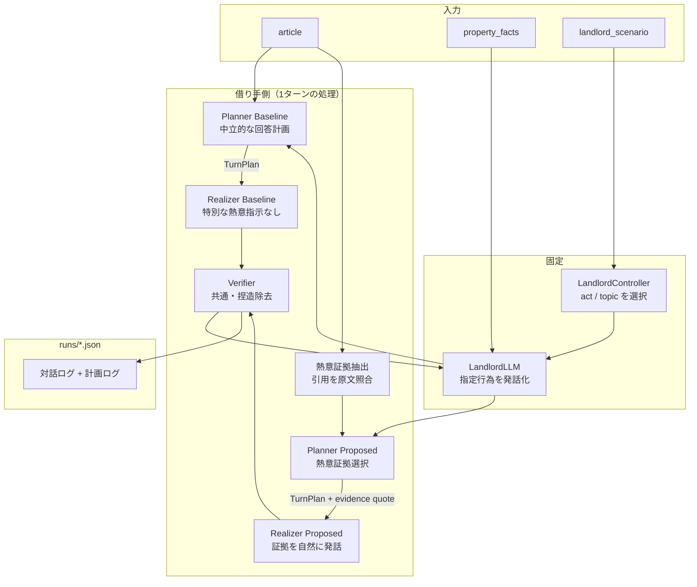

# 借り手AIエージェント実験システム 設計書

| 項目 | 内容 |
|---|---|
| 版 | v2.3（話題関連性に基づく選択的な熱意伝達） |
| 更新 | 2026-07-26 |
| 関連 | `研究方針.md`, `../README.md`, `../v1_fixed_emotion/設計書.md` |

---

## 1. 目的

逆さま不動産の文脈で、**借り手の記事に基づき大家と多ターン対話する借り手AIエージェント**を試作する。本システムは本番サービスではなく、次の研究仮説を検証するための **対話実験基盤** である。

> **熱意表現の特別指示がない借り手（Baseline）より、記事中の個人的価値・既遂行行動・継続姿勢などの検証済み証拠を状況に応じて伝える借り手（Proposed）の方が、大家の知覚熱意と面談意向を高めるか。**

実装ステータス（2026-07-26）：記事引用付きの熱意証拠抽出、話題関連性に基づく証拠選択Planner / Realizer、大家の対話行為Controller、陶作家ケース用シナリオを実装済み。

### 1.1 研究フレーム

対象とする大家は**貸すことには消極的だが場合によっては貸してもよいと思っている**層。その物件に対して複数の借り手エージェントがそれぞれ独立に熱意をアピールしながら対話する（**1対多の構図**）。

借り手AIが担うのは次の2点。本版では感情語を増やすのではなく、**本人にとっての意味と、すでに行ったことを記事上の証拠から示すこと**に注力する。

1. **熱意証拠の伝達（主）**：個人的原点・本人にとっての価値・既遂行行動・継続姿勢等から、直前の話題に直接関係する未使用証拠がある場合だけ1つ選ぶ
2. **適合確認の質問（従）**：必要に応じて使用イメージに関係する質問を1つ行う

実験では1対1の対話として実施するが、これは1対多の構図における個々の対話を模したものである。

### 1.2 スコープ内

- 借り手記事に基づく多ターン対話の自動生成
- 借り手側の2条件（Baseline = 特別な熱意指示なし / Proposed = 根拠に基づく熱意伝達）の比較
- 大家側は物件ファクトに grounding した LLM（全条件で同一）
- 対話ログの JSON 保存（計画ログ・選択ムーブ含む）と人手評価のためのメタデータ

### 1.3 スコープ外

- 逆さま不動産プラットフォームとの本番連携
- Web UI・認証・DB
- LLM-as-judge による自動評価の本格運用
- 発話トークン数の厳密制御（長さそのものは独立変数にしない）
- PPO・MCTS・DPO などの学習ベース手法の再現

---

## 2. システムの全体像

### 2.1 一言で

**条件ごとに借り手の Planner / Realizer を変え、制御された同一の大家シナリオと対話させる実験装置。**
Baseline は質問への中立的回答、Proposed は記事から抽出・原文照合した熱意証拠の選択。大家は対話行為をYAMLで固定し、文面だけをLLMが生成する。

### 2.2 登場人物

| 役 | 実装 | 実験での扱い |
|---|---|---|
| **熱意証拠抽出器** | LLM + 原文照合 | Proposedのみ。記事から証拠候補を抽出し、記事中に存在する引用だけを採用 |
| **Planner** | LLM + `planner_{condition}.txt` | **条件別**。Baseline は回答計画、Proposed は証拠タイプと応答方法を選択 |
| **Realizer（借り手AI）** | LLM + `realizer_{condition}.txt` | **条件別**。計画の実行方法が異なる |
| **Verifier** | LLM + `verifier.txt` | **両条件で共通**。発話後に捏造を除去する |
| **大家Controller** | YAML `landlord_scenario` + `landlord_agent.py` | ターンごとの `act` / `topic` を条件間で固定 |
| **大家LLM** | LLM + `landlord.txt` | Controllerが指定した行為を、物件ファクトの範囲で発話化 |
| **借り手記事** | YAML `article` | 両条件の根拠（記事全文） |
| **物件ファクト** | YAML `property_facts` | 大家が答えてよい事実の上限 |

### 2.3 なぜ Planner も条件別にするか

本版の独立変数は、記事中の**熱意証拠を意図的に選択・提示するか**である。
したがって Planner（何をするか）と Realizer（どう言うか）の両方を条件に対応させる。
Verifier と大家LLMは共通のままにし、捏造防止と対話相手を統制する。

### 2.4 なぜ Verifier を両条件で共通にするか

アピール技法を強めても記事にない事実を補完しやすい。Verifier を共通化することで、「構成が良かったのか・捏造が良かったのか」の混同を防ぐ。

### 2.5 ブロック図



---

## 3. 対話フロー

### 3.1 1ターンの処理順序

```
大家の発話
  ↓
[対話開始時・Proposedのみ] 熱意証拠抽出
  → articleから証拠候補を抽出
  → quoteがarticle原文に存在する項目だけを採用

[Step 1] Planner（条件別）
  → Baseline: 大家の質問への回答計画 JSON
  → Proposed: 直前の話題に直接関係する未使用の熱意証拠がある場合だけ選択
  → 関連証拠がなければ no_supported_signal とし、事実回答だけを計画
  → 大家の直前の act / topic、使用済み引用、残りターンを参照

  ↓
[Step 2] Realizer（条件別）
  → Baseline: 熱意を強める特別指示なしで発話
  → Proposed: 証拠が選ばれた場合は、質問への回答後に自然に伝える
  → no_supported_signal の場合は、別の熱意証拠を補わず事実回答だけを行う

  ↓
[Step 3] Verifier（共通）
  → 記事外の主張を削除し、Proposedでは選択済みの検証済み証拠を保持する

  ↓
借り手の発話（ログに TurnPlan 付き）

  ↓
[大家 Step 1] Controller
  → YAMLの response_steps から今ターンの act / topic を選択

  ↓
[大家 Step 2] 大家LLM
  → property_facts の範囲で、指定行為の文面を生成
```

### 3.2 ターン順序

1. **大家** が最初の挨拶を発話（`opening` 固定文）
2. **借り手 Step 1〜3 → 大家 Step 1〜2** を `max_turns=4`（デフォルト）まで繰り返す
3. ログを `runs/` に JSON 保存

### 3.3 TurnPlan の構造

**Baseline:**

```json
{
  "turn_goal": "appeal | ask_fit_question | empathize | reassure | close",
  "phase": "opening | middle | closing",
  "evidence_summary": "今ターンで使う借り手情報の要約",
  "ask_slot": null,
  "owner_concern": "unknown | cost | renovation | duration | other"
}
```

**Proposed:**

```json
{
  "move": "personal_origin | identity_value | enacted_commitment | persistence | concrete_episode | concern_aligned_commitment | future_continuity | no_supported_signal",
  "response_strategy": "answer_first | acknowledge_concern | ask_fit_question | close",
  "turn_goal": "appeal | answer | ask_fit_question | empathize | reassure | close",
  "evidence_quote": "抽出在庫から選んだ記事原文",
  "key_message": "今ターンで伝える核（1文）",
  "evidence_summary": "記事から使う根拠の要約",
  "ask_slot": null,
  "owner_concern": "unknown | cost | renovation | duration | other"
}
```

### 3.4 Proposed の熱意証拠タイプ

| move | 役割 |
|---|---|
| `personal_origin` | 活動を始めた個人的な原点 |
| `identity_value` | 活動が本人にとって持つ意味・こだわり |
| `enacted_commitment` | すでに行った学習・制作・活動 |
| `persistence` | 継続、試行錯誤、負担があっても追求する姿勢 |
| `concrete_episode` | 本人が経験した具体的な出来事 |
| `concern_aligned_commitment` | 周囲・地域・協力者に対する価値観 |
| `future_continuity` | 今後も継続・発展させる意思 |
| `no_supported_signal` | 直前の話題に直接関係する根拠がない、または未使用の根拠がなく、熱意の無理な挿入や創作を避ける |

---

## 4. 実験条件（比較設計）

### 4.1 変えるもの（独立変数）

| 条件 ID | Planner | Realizer | 内容 |
|---|---|---|---|
| `baseline` | `planner_baseline.txt` | `realizer_baseline.txt` | 大家の質問に記事の事実で答える。熱意表現の特別指示なし |
| `proposed` | `planner_proposed.txt` | `realizer_proposed.txt` | 検証済み熱意証拠が直前の話題に直接関係する場合だけ1つ選び提示 |

**Verifier・大家LLM・入力記事は両条件で同一。** 独立変数は熱意証拠の意図的な選択・提示の有無。

### 4.2 固定するもの（統制変数）

| 項目 | 固定内容 |
|---|---|
| LLM モデル | `claude-haiku-4-5`、`temperature=0`（全コンポーネント） |
| 大家 system prompt | `prompts/landlord.txt` 共通 |
| `property_facts` | ケースごとに同一（条件間で共有） |
| `opening` | 大家の初回発話（YAML に固定文を記載） |
| `landlord_scenario` | v2専用 `scenarios/` に置く大家の `act` / `topic` / `instruction`（条件間で共有） |
| ケース ID | 同一 YAML で2条件を実行 |

---

## 5. データ設計

### 5.1 ケースファイル `../shared/data/eval_cases/{case_id}.yaml`

```yaml
id: case01_ceramic_atelier
title: 陶作家のアトリエ兼住居を探す借り手
article: |
  （借り手が逆さま不動産に公開している記事全文）
meta:
  domain: reverse_real_estate
  source_url: https://...
  profile_created_by: llm_assisted
```

`article` のみを入力とする。事前生成した構造化プロファイルや質問スロットは入力せず、Planner が記事全文を実行時に解釈する。

### 5.2 物件ファイル `../shared/data/properties/{property_id}.yaml`

```yaml
id: property01_kuwana
title: 桑名市の空き家
property_facts:
  area: "約120㎡"
  smoke_stack: "設置可能（要事前確認）"
  ...
opening: "こんにちは。どのような使い方をお考えですか？"
meta:
  target_case: case01_ceramic_atelier
```

### 5.3 v2大家シナリオ `scenarios/{property_id}.yaml`

共有物件ファクトは変更せず、v2専用の対話行為だけを同じ物件IDのファイルから読み込んで重ねる。`experimental_profile` は物件の魅力・懸念・不明点・代替案のバランスを管理する研究者用メモで、LLMには渡さない。

```yaml
property_id: property01_kuwana
target_case: case01_ceramic_atelier
landlord_scenario:
  opening_action:
    act: ask_usage
    topic: intended_use
    instruction: "使い方を1つ尋ねる"
  response_steps:
    - act: ask_operation
      topic: kiln_and_workflow
      instruction: "具体的な制作方法を1つ尋ねる"
    - act: raise_concern
      topic: noise_and_smoke
      instruction: "近隣への音と煙の懸念を伝える"
    - act: ask_operation
      topic: storage_and_shipping
      instruction: "保管・発送作業を尋ねる"
    - act: close
      topic: end_conversation
      instruction: "質問や次アクションを出さず終える"
experimental_profile:
  attractive_features: ["離れ25㎡", "希望地域", "保管スペース"]
  concerns: ["窯の音と煙", "煙突工事"]
  unknowns: ["煙突の設置可否", "実際の音量と煙"]
  alternatives: ["離れを成形・乾燥・保管用に使う"]
```

### 5.4 ログ出力 `runs/{case_id}_{property_id}_{condition}_{timestamp}.json`

```json
{
  "case_id": "case01_ceramic_atelier",
  "property_id": "property01_kuwana",
  "condition": "baseline",
  "model_borrower": "claude-haiku-4-5",
  "model_landlord": "claude-haiku-4-5",
  "temperature": 0,
  "max_turns": 4,
  "turns": [
    {
      "role": "landlord",
      "content": "こんにちは。どのような使い方をお考えですか？",
      "landlord_action": {"act": "ask_usage", "topic": "intended_use", "instruction": "..."}
    },
    {
      "role": "borrower",
      "content": "アトリエ兼住居として使いたいと考えています。",
      "plan": {
        "turn_goal": "appeal",
        "phase": "opening",
        "evidence_summary": "陶作家として落ち着いた制作環境を求めている",
        "ask_slot": "smoke_stack",
        "owner_concern": "unknown"
      }
    },
    {
      "role": "landlord",
      "content": "窯を含め、どのように作品を制作するお考えですか？",
      "landlord_action": {"act": "ask_operation", "topic": "kiln_and_workflow", "instruction": "..."}
    }
  ]
}
```

---

## 6. コンポーネント設計

### 6.1 ディレクトリ

```
borrower_agent/
├── shared/                 # バージョン共通
│   ├── data/
│   │   ├── eval_cases/
│   │   ├── cases/
│   │   └── properties/
│   └── eval/
├── v1_fixed_emotion/       # 比較用 Baseline の実装元
└── v2_adaptive_planner/    # 本版
    ├── scenarios/          # v2専用の大家行為・物件設計メモ
    ├── src/
    ├── prompts/
    ├── scripts/
    │   └── run_experiment.py
    └── runs/
```

ケース・物件データは `../shared/data/` を参照する。
### 6.2 モジュール責務

| モジュール | 責務 |
|---|---|
| `models.py` | データ構造のみ。ロジックなし |
| `llm_client.py` | API 呼び出しの低レベルラッパー。`call_llm`（履歴付き）と `call_llm_single`（単発）の2関数 |
| `planner.py` | 対話履歴テキスト → TurnPlan JSON。条件に応じて Baseline / Proposed のプロンプトを使い分ける |
| `verifier.py` | 生成発話 + 記事 + 対話履歴 → 検証済み発話。両条件共通 |
| `borrower_policy.py` | `build_system_prompt(case, condition, plan)` → 条件別 system prompt（毎ターン plan を注入） |
| `landlord_agent.py` | YAMLから大家の対話行為を選び、物件ファクトと行為指示付きプロンプトを構築 |
| `dialogue_runner.py` | Planner → Realizer → Verifier → 大家Controller → 大家LLM のオーケストレーション。ログ保存 |

### 6.3 call_llm のロールマッピング

`call_llm(system, history, caller_role)`:
- `caller_role` の過去発話 → `"assistant"`
- 相手の発話 → `"user"`
- 先頭が `"assistant"` の場合は除去（Anthropic API の制約）

`call_llm_single(system, user_message)`:
- Planner・Verifier 専用。履歴なしの単発呼び出し

---

## 7. プロンプト方針

### 7.1 `prompts/planner_baseline.txt`

- 大家の質問への回答を計画し、感情・物語・説得を強める指示を持たない
- **JSON のみ出力**

### 7.2 `prompts/planner_proposed.txt`

- 原文照合済みの熱意証拠在庫から、直前の話題に直接関係する未使用項目がある場合だけ1つ選ぶ
- 関連項目がなければ、在庫が残っていても `no_supported_signal` を選ぶ
- 証拠タイプと応答方法を分離する
- 大家の `act` / `topic`、使用済み引用、残りターンを参照
- **JSON のみ出力**

### 7.3 `prompts/realizer_baseline.txt`

- `{article}` と `{plan_json}` を埋め込む
- 熱意を強める特別な表現指示を持たない

### 7.4 `prompts/realizer_proposed.txt`

- `{article}` と `{plan_json}` を埋め込む
- 選択された `evidence_quote` の意味を必ず保持する
- 大家の問いには先に答え、感情語で熱意を自己申告しない

### 7.5 `prompts/verifier.txt`

- `{article}` を埋め込む
- これまでの対話履歴も入力し、大家が述べた物件事実を借り手が受け止める発話は保持
- 根拠のない断定 → 削除または推測表現に変更
- 修正後の発話のみ出力（説明文不要）

### 7.6 `prompts/landlord.txt`

- `{property_facts}` を埋め込む（直接聞かれたときのみ参照）
- `{landlord_action}` を毎ターン埋め込み、LLMは指定された `act` / `topic` の文面のみを生成
- **`{article}` は渡さない**。大家はこの対話の時点で借り手の記事を読んでいない前提
- **借り手から大家に連絡してくる**。大家は受動的に話を聞く立場
- この場の目的は「借り手の話を聞いて貸したいか判断すること」。契約条件の提示・交渉は行わない
- 家賃・契約期間・契約条件はこちらから提示しない。聞かれても「この場では決めません」と短く返し、対面・内見・日程などの次アクションは提案しない
- 積極的な歓迎・勧誘をしない（消極的スタンス）

---

## 8. 評価設計

### 8.1 評価軸

この対話の目的は「大家に貸したいと感じてもらうこと」であり、条件のすり合わせは対面後に行う。評価軸もこの優先順位を反映する。

**主指標（研究の主眼）:**

| 軸 | 定義 | 測り方 |
|---|---|---|
| **Faithfulness** | 記事にない事実を述べていないか | 人手（ログ読解） |
| **Persona Consistency** | 借り手の動機・想いが発話に表れているか | 人手 |
| **Naturalness** | 大家への語りかけとして自然か | 人手（5段階） |

**補助指標（参考）:**

| 軸 | 定義 | 測り方 |
|---|---|---|
| **Task Success** | 借り手の使用イメージが大家に伝わったか | 人手（定性的） |

Task Success は「必要スロットを聞き出したか」ではなく「借り手の使い方が大家にイメージできたか」を見る。物件情報の網羅的確認はこの対話のスコープ外。

### 8.2 評価方法

- **主評価**：同一シナリオの Baseline と Proposed を blind pairwise で比較（どちらが代弁として良いか）
- **補助診断**：Verifier による変更有無、`plan.ask_slot` の使用回数をログから自動集計

### 8.3 評価体制

- 評価者：研究室メンバー複数名
- 条件名を除いたログ（`case01_1.json` / `case01_2.json`）で評価し、採点後に対応表を参照

### 8.4 評価の対象

**評価対象は借り手の発話のみ。** 大家の発話は評価しない。

- 大家LLMは会話を成立させるための足場であり、その反応は評価指標ではない
- 大家が「素晴らしい」「感動した」などと返しても、それは借り手の発話品質の証拠にならない
- 人間評価者は借り手の発話を読み、上記の評価軸（Faithfulness・Persona Consistency・Naturalness）で判断する

---

## 9. CLI

```bash
# 全ケース・両条件
python scripts/run_experiment.py --all-cases --conditions baseline,proposed

# ランダムに3人選出
python scripts/run_experiment.py --random-cases --n 3 --conditions baseline,proposed

# 手動指定
python scripts/run_experiment.py --cases case01_ceramic_atelier --conditions baseline,proposed
```

環境変数（`.env`）:

```
ANTHROPIC_API_KEY=sk-ant-...
ANTHROPIC_MODEL=claude-haiku-4-5-20251001
```

---

## 10. リスクと対策

| リスク | 対策 |
|---|---|
| 大家が facts 外を答える | temperature=0、「その点は確認が必要です」フォールバック明示 |
| 条件間で大家の質問や懸念が大きく変わる | `landlord_scenario` の対話行為を共通化し、LLMは文面生成のみを担当 |
| シナリオと実行ターン数がずれる | `response_steps` と `max_turns` の不一致を実行前にエラーにする |
| 借り手が捏造する | Verifier が記事外の断定を除去 |
| 条件間で入力や対話相手まで変わる | 借り手記事、Verifier、大家LLM、物件情報を共通化し、独立変数をアピール構成の決め方に限定 |
| Planner の JSON が壊れる | `_FALLBACK` で代替計画を使用 |
| API コスト増（1ターンに Planner / Realizer / Verifier / 大家4呼び出し） | haiku 使用、temperature=0 で再現性確保 |

---

## 11. 将来の拡張可能性

| 拡張方向 | 概要 |
|---|---|
| **感情ポリシーの最適化**（EvoEmo方向） | RL で最適な感情遷移ポリシーを学習 |
| **発話の反復的品質改善**（DMNA方向） | Reflexion 機構で共感性・説得力を向上 |
| **大家 simulator の多様化** | 慎重型・実務重視型など複数スタンスの大家を用意 |
| **大規模な1対多実験** | 複数物件 × 多数借り手の並行実験基盤に拡張 |

---

## 12. 変更履歴

| 版 | 日付 | 内容 |
|---|---|---|
| v0.1 | 2026-05-27 | 初版 |
| v0.2 | 2026-05-27 | モデルを Claude 系（haiku）に変更。DialogueRunner 共有ログ方式 |
| v0.3 | 2026-06-03 | 感情表現重視への方針転換。大家に消極的スタンスと代替案提示を追加 |
| v0.4 | 2026-06-09 | 比較条件の再設計。独立変数を感情表現指示の有無に一本化 |
| v0.5 | 2026-06-16 | Planner → Realizer → Verifier の3段構成に刷新。独立変数の純化と Faithfulness の実装的担保 |
| v2.0-dev | 2026-07-15 | `v2_adaptive_planner` として分離 |
| v2.0 | 2026-07-15 | 修辞ムーブ6種の選択を実装。Baseline=固定感情、Proposed=ムーブ選択 |
| v2.0.1 | 2026-07-19 | 現行実装に合わせて条件別Planner、4ターン、大家の次アクション非提案を明記 |
| v2.1 | 2026-07-19 | 大家を対話行為制御 + LLM文面生成のハイブリッド方式に変更。借り手Plannerに対話状態を追加 |
| v2.2 | 2026-07-19 | Baselineを熱意指示なしへ修正。Proposedを記事引用に基づく熱意証拠抽出・選択方式へ変更 |
| v2.3 | 2026-07-26 | 直前の話題に直接関係する場合だけ熱意証拠を選択。`no_supported_signal` の自動上書きを廃止 |
