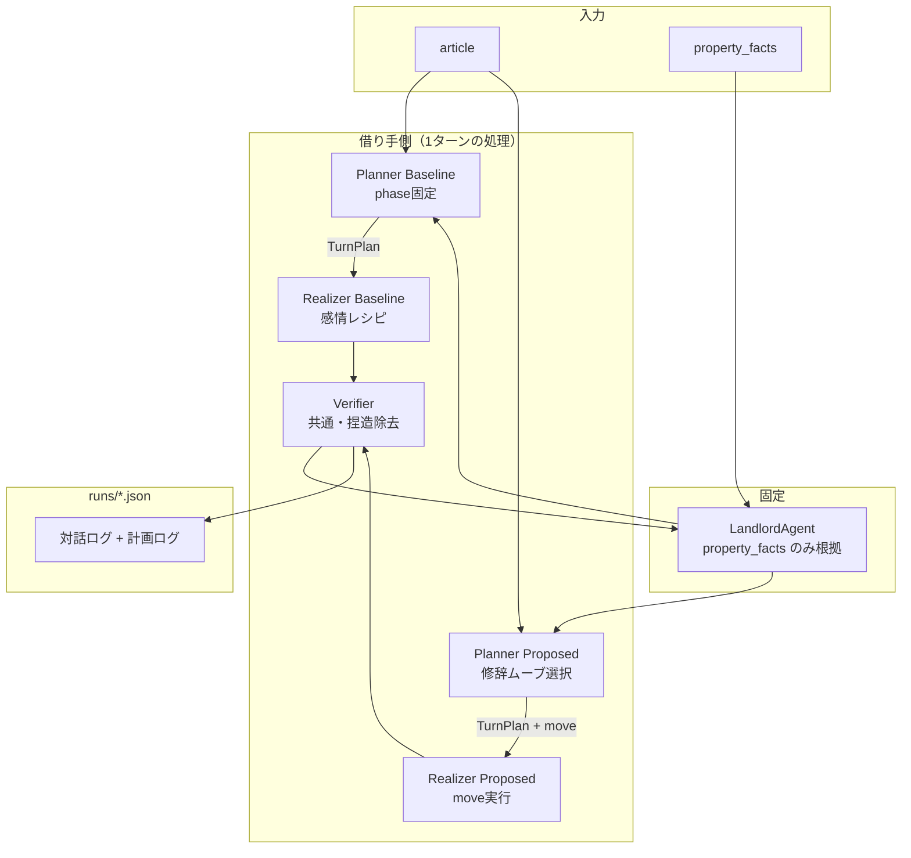

# 借り手AIエージェント実験システム 設計書

| 項目 | 内容 |
|---|---|
| 版 | v2.0（修辞ムーブ選択によるアピール構成） |
| 更新 | 2026-07-15 |
| 関連 | `研究方針.md`, `../README.md`, `../v1_fixed_emotion/設計書.md` |

---

## 1. 目的

逆さま不動産の文脈で、**借り手の記事に基づき大家と多ターン対話する借り手AIエージェント**を試作する。本システムは本番サービスではなく、次の研究仮説を検証するための **対話実験基盤** である。

> **固定の感情表現レシピ（Baseline = v1 の Proposed 相当）より、面接・プレゼン由来の修辞ムーブを状況に応じて選ぶ方式（Proposed）の方が、熱意と使い方イメージの両立した対話品質が高くなるか。**

実装ステータス（2026-07-15）：6ムーブ選択の Planner / Realizer を実装済み。

### 1.1 研究フレーム

対象とする大家は**貸すことには消極的だが場合によっては貸してもよいと思っている**層。その物件に対して複数の借り手エージェントがそれぞれ独立に熱意をアピールしながら対話する（**1対多の構図**）。

借り手AIが担うのは次の2点。本版では「感情を足す」ことより、**人間がアピールするときの伝え方の型**を状況に応じて選ぶことに注力する。

1. **アピール構成（主）**：エレベーターピッチ、具体情景、先に答える等の修辞ムーブで想いと使い方を届ける
2. **適合確認の質問（従）**：必要に応じて `ask_with_image` で使い方イメージ付きの質問を行う

実験では1対1の対話として実施するが、これは1対多の構図における個々の対話を模したものである。

### 1.2 スコープ内

- 借り手記事に基づく多ターン対話の自動生成
- 借り手側の2条件（Baseline = 固定感情 / Proposed = 修辞ムーブ）の比較
- 大家側は物件ファクトに grounding した LLM（全条件で同一）
- 対話ログの JSON 保存（計画ログ・選択ムーブ含む）と人手評価のためのメタデータ

### 1.3 スコープ外

- 逆さま不動産プラットフォームとの本番連携
- Web UI・認証・DB
- LLM-as-judge による自動評価の本格運用
- 発話トークン数の厳密制御（長さそのものは独立変数にしない）
- PPO・MCTS・DPO などの学習ベース手法の再現

---

## 2. システムの全体像

### 2.1 一言で

**条件ごとに Planner が計画の立て方を変え、Realizer がその計画を実現する実験装置。**
Baseline は phase 固定の感情レシピ、Proposed は面接・プレゼン由来の修辞ムーブ選択。

### 2.2 登場人物

| 役 | 実装 | 実験での扱い |
|---|---|---|
| **Planner** | LLM + `planner_{condition}.txt` | **条件別**。Baseline は phase 計画、Proposed は move 選択 |
| **Realizer（借り手AI）** | LLM + `realizer_{condition}.txt` | **条件別**。計画の実行方法が異なる |
| **Verifier** | LLM + `verifier.txt` | **両条件で共通**。発話後に捏造を除去する |
| **大家LLM** | LLM + `landlord.txt` | **全条件で固定** |
| **借り手記事** | YAML `article` | 両条件の根拠（記事全文） |
| **物件ファクト** | YAML `property_facts` | 大家が答えてよい事実の上限 |

### 2.3 なぜ Planner も条件別にするか

本版の独立変数は「感情 style」ではなく**アピール構成の決め方**である。
したがって Planner（何をするか）と Realizer（どう言うか）の両方を条件に対応させる。
Verifier と大家LLMは共通のままにし、捏造防止と対話相手を統制する。

### 2.4 なぜ Verifier を両条件で共通にするか

アピール技法を強めても記事にない事実を補完しやすい。Verifier を共通化することで、「構成が良かったのか・捏造が良かったのか」の混同を防ぐ。

### 2.5 ブロック図



---

## 3. 対話フロー

### 3.1 1ターンの処理順序

```
大家の発話
  ↓
[Step 1] Planner（条件別）
  → Baseline: phase 固定の計画 JSON
  → Proposed: 修辞ムーブ（move）を含む計画 JSON

  ↓
[Step 2] Realizer（条件別）
  → Baseline: phase 別の感情表現ガイドで発話
  → Proposed: 選ばれた move の型で発話

  ↓
[Step 3] Verifier（共通）
  → 記事に根拠のない主張を削除・弱める

  ↓
借り手の発話（ログに TurnPlan 付き）

  ↓
大家LLM が property_facts の範囲で応答
```

### 3.2 ターン順序

1. **大家** が最初の挨拶を発話（`opening` 固定文）
2. **Step 1〜3** を `max_turns=4`（デフォルト）まで繰り返す
3. ログを `runs/` に JSON 保存

### 3.3 TurnPlan の構造

**Baseline:**

```json
{
  "turn_goal": "appeal | ask_fit_question | empathize | reassure | close",
  "phase": "opening | middle | closing",
  "evidence_summary": "今ターンで使う借り手情報の要約",
  "ask_slot": null,
  "owner_concern": "unknown | cost | renovation | duration | other"
}
```

**Proposed:**

```json
{
  "move": "elevator_hook | concrete_scene | answer_first | acknowledge_reframe | ask_with_image | close",
  "turn_goal": "appeal | answer | ask_fit_question | empathize | reassure | close",
  "key_message": "今ターンで伝える核（1文）",
  "evidence_summary": "記事から使う根拠の要約",
  "ask_slot": null,
  "owner_concern": "unknown | cost | renovation | duration | other"
}
```

### 3.4 Proposed の修辞ムーブ

| move | 由来 | 役割 |
|---|---|---|
| `elevator_hook` | エレベーターピッチ／面接の自己紹介 | 核を1文で言い切る |
| `concrete_scene` | プレゼンの導入後の姿 | 使い方の情景で見せる |
| `answer_first` | 面接の質問応答 | 質問に先に答える |
| `acknowledge_reframe` | 面接の懸念対応 | 受け止めてから再主張 |
| `ask_with_image` | 逆質問＋ビジョン | 質問に使い方イメージを添える |
| `close` | プレゼンの締め | 核を短く再提示して閉じる |

---

## 4. 実験条件（比較設計）

### 4.1 変えるもの（独立変数）

| 条件 ID | Planner | Realizer | 内容 |
|---|---|---|---|
| `baseline` | `planner_baseline.txt` | `realizer_baseline.txt` | v1 Proposed 相当。phase 固定の感情レシピ |
| `proposed` | `planner_proposed.txt` | `realizer_proposed.txt` | 状況に応じて修辞ムーブを選択 |

**Verifier・大家LLM・入力記事は両条件で同一。** 独立変数はアピール構成の決め方。

### 4.2 固定するもの（統制変数）

| 項目 | 固定内容 |
|---|---|
| LLM モデル | `claude-haiku-4-5`、`temperature=0`（全コンポーネント） |
| 大家 system prompt | `prompts/landlord.txt` 共通 |
| `property_facts` | ケースごとに同一（条件間で共有） |
| `opening` | 大家の初回発話（YAML に固定文を記載） |
| ケース ID | 同一 YAML で2条件を実行 |

---

## 5. データ設計

### 5.1 ケースファイル `../shared/data/eval_cases/{case_id}.yaml`

```yaml
id: case01_ceramic_atelier
title: 陶作家のアトリエ兼住居を探す借り手
article: |
  （借り手が逆さま不動産に公開している記事全文）
meta:
  domain: reverse_real_estate
  source_url: https://...
  profile_created_by: llm_assisted
```

`article` のみを入力とする。構造化プロファイル（profile/slots）は Planner が実行時に動的に解釈する。

### 5.2 物件ファイル `../shared/data/properties/{property_id}.yaml`

```yaml
id: property01_kuwana
title: 桑名市の空き家
property_facts:
  area: "約120㎡"
  smoke_stack: "設置可能（要事前確認）"
  ...
opening: "こんにちは。どのような使い方をお考えですか？"
meta:
  target_case: case01_ceramic_atelier
```

### 5.3 ログ出力 `runs/{case_id}_{property_id}_{condition}_{timestamp}.json`

```json
{
  "case_id": "case01_ceramic_atelier",
  "property_id": "property01_kuwana",
  "condition": "baseline",
  "model_borrower": "claude-haiku-4-5",
  "model_landlord": "claude-haiku-4-5",
  "temperature": 0,
  "max_turns": 6,
  "turns": [
    {"role": "landlord", "content": "こんにちは。どのような使い方をお考えですか？"},
    {
      "role": "borrower",
      "content": "アトリエ兼住居として使いたいと考えています。",
      "plan": {
        "turn_goal": "appeal",
        "phase": "opening",
        "evidence_summary": "陶作家として落ち着いた制作環境を求めている",
        "ask_slot": "smoke_stack",
        "owner_concern": "unknown"
      }
    },
    {"role": "landlord", "content": "煙突は設置可能です。"}
  ]
}
```

---

## 6. コンポーネント設計

### 6.1 ディレクトリ

```
borrower_agent/
├── shared/                 # バージョン共通
│   ├── data/
│   │   ├── eval_cases/
│   │   ├── cases/
│   │   └── properties/
│   └── eval/
├── v1_fixed_emotion/       # 比較用 Baseline の実装元
└── v2_adaptive_planner/    # 本版
    ├── src/
    ├── prompts/
    ├── scripts/
    │   └── run_experiment.py
    └── runs/
```

ケース・物件データは `../shared/data/` を参照する。
### 6.2 モジュール責務

| モジュール | 責務 |
|---|---|
| `models.py` | データ構造のみ。ロジックなし |
| `llm_client.py` | API 呼び出しの低レベルラッパー。`call_llm`（履歴付き）と `call_llm_single`（単発）の2関数 |
| `planner.py` | 対話履歴テキスト → TurnPlan JSON。両条件共通 |
| `verifier.py` | 生成発話 + 記事 → 検証済み発話。両条件共通 |
| `borrower_policy.py` | `build_system_prompt(case, condition, plan)` → 条件別 system prompt（毎ターン plan を注入） |
| `landlord_agent.py` | `build_system_prompt(prop)` → 物件ファクト付き大家プロンプト |
| `dialogue_runner.py` | Planner → Realizer → Verifier のオーケストレーション。ログ保存 |

### 6.3 call_llm のロールマッピング

`call_llm(system, history, caller_role)`:
- `caller_role` の過去発話 → `"assistant"`
- 相手の発話 → `"user"`
- 先頭が `"assistant"` の場合は除去（Anthropic API の制約）

`call_llm_single(system, user_message)`:
- Planner・Verifier 専用。履歴なしの単発呼び出し

---

## 7. プロンプト方針

### 7.1 `prompts/planner_baseline.txt`

- v1 Proposed 相当の計画器。phase 固定で感情表現を毎ターンの基本とする
- **JSON のみ出力**

### 7.2 `prompts/planner_proposed.txt`

- 面接・プレゼン由来の6ムーブから1つを選ぶ
- 大家の直前発話（質問／懸念／その他）に応じた選択ルールを明示
- `key_message` は1つだけ
- **JSON のみ出力**

### 7.3 `prompts/realizer_baseline.txt`

- `{article}` と `{plan_json}` を埋め込む
- **phase 別の感情表現ガイド**（v1 Proposed と同じ）

### 7.4 `prompts/realizer_proposed.txt`

- `{article}` と `{plan_json}` を埋め込む
- phase ガイドは持たない
- **move 別の書き方**に従って発話する（elevator_hook / concrete_scene 等）

### 7.5 `prompts/verifier.txt`

- `{article}` を埋め込む
- 根拠のない断定 → 削除または推測表現に変更
- 修正後の発話のみ出力（説明文不要）

### 7.6 `prompts/landlord.txt`

- `{property_facts}` を埋め込む（直接聞かれたときのみ参照）
- **`{article}` は渡さない**。大家はこの対話の時点で借り手の記事を読んでいない前提
- **借り手から大家に連絡してくる**。大家は受動的に話を聞く立場
- この場の目的は「借り手の話を聞いて貸したいか判断すること」。契約条件の提示・交渉は行わない
- 家賃・契約期間・契約条件はこちらから提示しない。聞かれても「実際に会って相談しましょう」と返す
- 積極的な歓迎・勧誘をしない（消極的スタンス）

---

## 8. 評価設計

### 8.1 評価軸

この対話の目的は「大家に貸したいと感じてもらうこと」であり、条件のすり合わせは対面後に行う。評価軸もこの優先順位を反映する。

**主指標（研究の主眼）:**

| 軸 | 定義 | 測り方 |
|---|---|---|
| **Faithfulness** | 記事にない事実を述べていないか | 人手（ログ読解） |
| **Persona Consistency** | 借り手の動機・想いが発話に表れているか | 人手 |
| **Naturalness** | 大家への語りかけとして自然か | 人手（5段階） |

**補助指標（参考）:**

| 軸 | 定義 | 測り方 |
|---|---|---|
| **Task Success** | 借り手の使用イメージが大家に伝わったか | 人手（定性的） |

Task Success は「必要スロットを聞き出したか」ではなく「借り手の使い方が大家にイメージできたか」を見る。物件情報の網羅的確認はこの対話のスコープ外。

### 8.2 評価方法

- **主評価**：同一シナリオの Baseline と Proposed を blind pairwise で比較（どちらが代弁として良いか）
- **補助診断**：Verifier による変更有無、`plan.ask_slot` の使用回数をログから自動集計

### 8.3 評価体制

- 評価者：研究室メンバー複数名
- 条件名を除いたログ（`case01_1.json` / `case01_2.json`）で評価し、採点後に対応表を参照

### 8.4 評価の対象

**評価対象は借り手の発話のみ。** 大家の発話は評価しない。

- 大家LLMは会話を成立させるための足場であり、その反応は評価指標ではない
- 大家が「素晴らしい」「感動した」などと返しても、それは借り手の発話品質の証拠にならない
- 人間評価者は借り手の発話を読み、上記の評価軸（Faithfulness・Persona Consistency・Naturalness）で判断する

---

## 9. CLI

```bash
# 全ケース・両条件
python scripts/run_experiment.py --all-cases --conditions baseline,proposed

# ランダムに3人選出
python scripts/run_experiment.py --random-cases --n 3 --conditions baseline,proposed

# 手動指定
python scripts/run_experiment.py --cases case01_ceramic_atelier --conditions baseline,proposed
```

環境変数（`.env`）:

```
ANTHROPIC_API_KEY=sk-ant-...
ANTHROPIC_MODEL=claude-haiku-4-5-20251001
```

---

## 10. リスクと対策

| リスク | 対策 |
|---|---|
| 大家が facts 外を答える | temperature=0、「その点は確認が必要です」フォールバック明示 |
| 借り手が捏造する | Verifier が記事外の断定を除去 |
| 2条件の差が計画の違いで生じる | Planner を共通化し、独立変数を style 指示のみに限定 |
| Planner の JSON が壊れる | `_FALLBACK` で代替計画を使用 |
| API コスト増（LLM呼び出しが3倍） | haiku 使用、temperature=0 で再現性確保 |

---

## 11. 将来の拡張可能性

| 拡張方向 | 概要 |
|---|---|
| **感情ポリシーの最適化**（EvoEmo方向） | RL で最適な感情遷移ポリシーを学習 |
| **発話の反復的品質改善**（DMNA方向） | Reflexion 機構で共感性・説得力を向上 |
| **大家 simulator の多様化** | 慎重型・実務重視型など複数スタンスの大家を用意 |
| **大規模な1対多実験** | 複数物件 × 多数借り手の並行実験基盤に拡張 |

---

## 12. 変更履歴

| 版 | 日付 | 内容 |
|---|---|---|
| v0.1 | 2026-05-27 | 初版 |
| v0.2 | 2026-05-27 | モデルを Claude 系（haiku）に変更。DialogueRunner 共有ログ方式 |
| v0.3 | 2026-06-03 | 感情表現重視への方針転換。大家に消極的スタンスと代替案提示を追加 |
| v0.4 | 2026-06-09 | 比較条件の再設計。独立変数を感情表現指示の有無に一本化 |
| v0.5 | 2026-06-16 | Planner → Realizer → Verifier の3段構成に刷新。独立変数の純化と Faithfulness の実装的担保 |
| v2.0-dev | 2026-07-15 | `v2_adaptive_planner` として分離 |
| v2.0 | 2026-07-15 | 修辞ムーブ6種の選択を実装。Baseline=固定感情、Proposed=ムーブ選択 |
