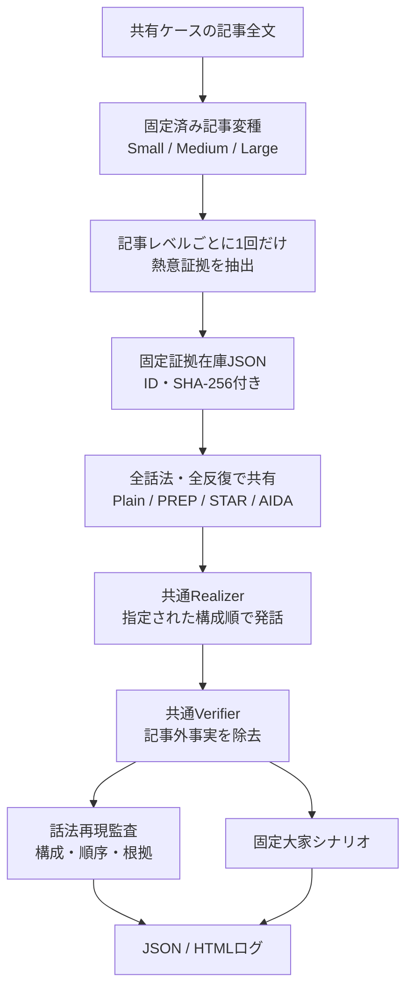

# 借り手AIエージェント V3 設計書

| 項目 | 内容 |
|---|---|
| 版 | v3.1（既存話法の再現・比較 × 記事情報豊富度） |
| 作成 | 2026-07-26 |
| v3.1更新 | 2026-07-26（証拠在庫固定、再現指標分離、実行順・反復統制） |
| 前版 | `../v2_adaptive_planner/` |
| 実装状態 | 4話法・3情報条件・再現監査・陶作家パイロットケースを実装 |

---

## 1. V3を作る意図

V2では、記事中の個人的価値・既遂行行動・継続姿勢などを「熱意の証拠」として抽出し、対話状況に応じて選択する方法を試した。これは主に、**何を伝えるか**を扱う版である。

V3では、記事から得られる内容を増幅する新しい感情表現を考案するのではなく、セールス・プレゼンテーション・就職面接ですでに使われている話法を借り手AIが再現し、その違いを比較する。主に扱うのは、**記事にある内容をどのような順序と構造で伝えるか**である。

同時に、借り手記事は人物によって情報量が異なる。豊富な記事では成立する話法が、短い記事では構成要素を埋められず、事実の創作を誘発する可能性がある。そこでV3は、話法だけでなく、同一人物の記事の情報豊富度を大・中・小に操作する。

V3の中心的な問いは、単純な「最強の話法は何か」ではない。

> **どの話法を、どの程度の記事情報があるときに、記事に忠実なまま再現でき、その組み合わせが大家の知覚熱意と面談意向につながるか。**

この目的のため、話法と記事情報量以外の要素を同時に改良しない。大家シナリオ、物件情報、モデル、Verifier、ターン数などは条件間で固定する。

---

## 2. 研究質問

- **RQ1（再現性）**：LLMは既存話法の構成要素と順序を、借り手記事に忠実に再現できるか
- **RQ2（有効性）**：どの話法が知覚熱意・本人らしさ・面談意向を高めるか
- **RQ3（交互作用）**：話法の再現性と有効性は、記事の情報豊富度によってどう変化するか
- **RQ4（過剰補完）**：情報が少ないとき、話法の構成を埋めるために記事外の成果・因果関係・能力を創作しないか

### 想定する仮説

- H1：Plainと比べ、構造化話法は知覚熱意または面談意向を変化させる
- H2：情報が豊富なほど、話法の完全再現率は高くなる
- H3：話法の効果は一様ではなく、情報豊富度との交互作用を持つ
- H4：STARは具体的経験・行動・結果がある記事では成立しやすいが、小条件ではResultなどが欠落しやすい
- H5：構造を強制するほど、情報不足時の捏造または不自然さのリスクが高くなる

---

## 3. 比較する話法

### 3.1 Plain（比較基準）

大家の質問へ直接答え、関連する記事上の根拠があれば自然に1件添える。特定の話法構造は指定しない。V3における比較基準であり、「感情なし」を意味する条件ではない。

### 3.2 PREP

`Point → Reason → Example → Point` の順に、結論、理由、具体例、結論の再提示を行う。短い発表や就職活動の文章・面接受け答えに利用されている。愛知工業大学の就職ノートも、自己PR・志望動機と面接回答の構成としてPREPを説明している。

- Point：物件で実現したいこと
- Reason：本人の動機・価値
- Example：記事にある具体的経験・行動
- Point：目的または継続意思として短く結ぶ

参考：[愛知工業大学「就職ノート2025」](https://www.ait.ac.jp/career/assets/docs/center_for-students_handbook2025.pdf)

### 3.3 STAR

`Situation / Task → Action → Result` によって、過去の行動を具体化する就職面接の手法である。米国人事管理局（OPM）のStructured Interviews資料でも、背景・状況、行動、結果を記述するモデルとして示されている。

- Situation：活動の背景
- Task：達成しようとしたこと、向き合った課題
- Action：本人が実際に行ったこと
- Result：記事に明記された結果・反応

Resultが記事にない場合、「努力した結果、評価された」などを補ってはいけない。欠落したまま記録する。

参考：[U.S. Office of Personnel Management, Structured Interviews](https://www.opm.gov/policy-data-oversight/assessment-and-selection/structured-interviews/structured-interviews.pdf)

### 3.4 AIDA

マーケティングコミュニケーションで用いられる `Attention → Interest → Desire → Action` の段階モデルである。

- Attention：本人固有の具体的な活動で注意を引く
- Interest：動機や本人にとっての意味を伝える
- Desire：その物件で続けたい活動・将来像を伝える
- Action：本人からさらに話を聞くことを低圧に検討してもらう

AIDAは本来、購買等の行動を促すモデルである。そのまま適用すると、借り手AIが大家に面談・内見・契約を迫り、逆さま不動産における「きっかけ作り」の範囲を越える。このためV3のActionは、日程や契約を求めず、**関心があれば本人からさらに話を聞くことを検討してもらう発話**に限定する。最終ターンでは全条件共通の「次アクションを増やさない」制約を優先し、AIDA自体を適用しない。

したがって本条件は、AIDAの構成を逆さま不動産へ制約付きで移植した `AIDA-adapted` と解釈する。最終ターン以外のActionはAIDAという手法パッケージの一部として残るため、Meeting Intentionへの効果を「語順だけの効果」と解釈しない。

参考：[Kartikasari et al., “Driving startup growth: A comprehensive review of the AIDA model's impact on marketing communications”](https://journal.steipress.org/index.php/ijbam/article/view/246)

---

## 4. 記事情報豊富度の操作

### 4.1 「文字量」ではなく「情報豊富度」

長い記事を単に短く要約すると、同じ意味を短く書いただけなのか、判断材料そのものを削ったのか区別できない。V3では文字数ではなく、大家が借り手を判断するための記事上の意味単位を操作する。

| 条件 | 含める情報 |
|---|---|
| Small | 本人、活動目的、物件の用途、最低限必要な設備 |
| Medium | Small＋動機、現在の活動、既遂行行動、観測可能な反応、必要性 |
| Large | 共有ケース全文。Medium＋個人的原点、詳細な経験、価値観、困難、継続姿勢など |

各ケースは可能な限り入れ子構造にする。

```text
Small ⊂ Medium ⊂ Large
```

実験で操作しているのは厳密な文字数ではなく、`article information richness` または「記事情報豊富度」である。情報量を増やすと情報種類も増えるため、両者を完全には分離できない。この限界を分析・論文で明記する。

### 4.2 自動要約を使わない理由

実験実行時にLLMで大・中・小を生成すると、試行ごとに残る情報が変化し、話法条件との比較が不安定になる。そのため、`article_variants/{case_id}.yaml` に研究者が確認した固定記事を置く。変種がないケースへ自動生成でフォールバックしない。

---

## 5. 実験計画

### 5.1 二要因計画

陶作家パイロットケースでは、次の12条件を生成する。

| 話法＼記事 | Small | Medium | Large |
|---|---:|---:|---:|
| Plain | ○ | ○ | ○ |
| PREP | ○ | ○ | ○ |
| STAR | ○ | ○ | ○ |
| AIDA | ○ | ○ | ○ |

独立変数：

1. 話法：4水準
2. 記事情報豊富度：3水準

統制：

- 同一人物・同一物件
- 同一大家シナリオと発話行為順
- 同一LLM・temperature・最大ターン数
- 同一記事レベルから一度だけ抽出・保存した、同一ハッシュの熱意証拠在庫
- 同一Verifier
- 同一の最大発話文数

条件の実行順は `order_seed` を用いてランダム化し、各条件を `repetitions` 回反復する。バッチ開始前に予定された全条件順を `runs/batches/{batch_id}.json` へ保存し、各対話ログにもバッチID、反復番号、実行順、順序seedを保存する。ここでのseedは条件順の再現用であり、LLM生成自体のseedではない。

### 5.2 二段階評価

**段階A：手法を再現できたか**

- 計画で利用可能だった構成要素が発話に現れたか（`available_slots_realized`）
- 規定された順序になっているか
- 必須構成要素が欠落せず、話法全体が成立したか（`canonical_method_complete`）
- 記事または大家発話に根拠づけられているか
- 情報不足で欠けた要素は何か

**段階B：対話として効果があったか**

- Perceived Passion
- Meeting Intention
- Authenticity / Enacted Commitment
- Naturalness
- 質問への回答性
- Faithfulness
- 押しつけがましさ・過剰説得

再現性と効果を分けることで、「手法自体が効かなかった」のか、「手法を正しく生成できなかった」のかを区別する。

---

## 6. システム構成



### 6.1 Planner

指定話法の各構成要素へ、記事中に連続して存在する原文引用を割り当てる。引用はコード側でも原文照合する。

Plannerが生成した引用の説明文は、そのままRealizerへ渡さない。説明文に原文以上の因果関係や成果が混入する経路を避けるため、コード側で各要素の意味内容を検証済み原文へ固定する。

各 `case_id × information_level` について証拠抽出を一度だけ行い、`evidence_inventories/` にJSON保存する。同じ固定在庫を4話法・全反復へ渡し、在庫IDとSHA-256を各対話ログへ記録する。記事または抽出プロンプトが変わった場合は暗黙に再生成せず、`--refresh-evidence-cache` を指定した場合だけ更新する。

全手法は同一の固定証拠在庫を利用する。ただし、PREP・STAR・AIDAでは必要な構成要素が異なるため、在庫から実際に選ぶ証拠まで同一になるとは限らない。したがって現在のV3が比較するのは、証拠選択を含む**話法の運用全体**である。将来、表現順序だけの純粋な効果を調べる場合は、同一の証拠集合を全Realizerへ再生する別実験が必要になる。

情報が不足している場合：

- 空の構成要素を創作しない
- `missing_slots` に記録する
- PREP / STARは根拠付き要素が2件未満なら `apply_method=false`
- AIDAはAttention / Interest / Desireの根拠が合計2件未満ならActionを出さない
- PREPの `point_restated` は新しい証拠を要求せず、最初のPointと同じ引用を再表現できる
- 最終ターンのAIDAは `apply_method=false` とし、Actionを出さない

### 6.2 Realizer

大家の質問に先に答えた後、`apply_method=true` の場合だけ、空でない構成要素を定義順に発話する。最大5文とする。

### 6.3 Verifier

V2と同様に、記事外の事実・成果・因果関係・作業方法等を除去する。計画された複数引用の意味を保持する。AIDAのActionは発話行為であり、記事上の人物事実ではないため、限定された表現だけを許可する。

### 6.4 Method Auditor

Verifier後の最終発話を対象として、構成要素の出現、順序、根拠忠実性をJSONで記録する。再現性は次の二つに分離する。

- `available_slots_realized`：記事から利用可能だった要素を発話できたか
- `canonical_method_complete`：必須要素が欠落せず、規定順序で話法全体が成立したか

`missing_slots` があるPREP・STAR・AIDAは、利用可能要素をすべて話せても `canonical_method_complete=false` になる。Plainは話法完全成立の対象外なのでnullとする。これは実験効果の自動評価ではなく、**実験操作が成立したかを確認する操作チェック**である。

---

## 7. ログ

各ログには以下を保存する。

- `method`
- `information_level`
- 記事から抽出した熱意証拠在庫
- `evidence_inventory_id`
- `evidence_inventory_sha256`
- `batch_id`
- `replicate_index`
- `execution_index`
- `order_seed`
- 各ターンの `apply_method`
- `method_slots`
- `missing_slots`
- `selected_evidence_quotes`
- Verifier後発話
- `method_audit`
- 固定された大家行為

ファイル名：

```text
{case}_{property}_{information_level}_{batch}_r{replicate}_o{order}_{timestamp}_{method}.json
```

---

## 8. 実行方法

```bash
cd SourceCode/borrower_agent/v3_method_comparison
python scripts/run_experiment.py \
  --cases case01_ceramic_atelier \
  --methods plain,prep,star,aida \
  --information-levels small,medium,large \
  --repetitions 3 \
  --order-seed 42
```

API利用量を抑えた試走：

```bash
python scripts/run_experiment.py \
  --cases case01_ceramic_atelier \
  --methods prep \
  --information-levels small \
  --no-method-audit
```

固定証拠在庫は初回実行時に生成され、以後再利用される。記事または抽出方法を意図的に変更した場合だけ次を使う。

```bash
python scripts/run_experiment.py \
  --cases case01_ceramic_atelier \
  --methods plain \
  --information-levels small,medium,large \
  --refresh-evidence-cache
```

話法監査の集計：

```bash
python scripts/summarize_method_audits.py
python scripts/summarize_method_audits.py --output runs/method_audits.csv
```

人手評価案は `eval/rubric.md` に置く。

---

## 9. 現時点の注意

- 実装済みの情報量変種は陶作家ケースのみ
- AIDAは研究対象への適合のためActionを制限した適応版
- AIDAのActionはMeeting Intentionと近い内容を持つため、AIDA全体の効果として解釈し、語順だけに帰属しない
- 各話法を全ターンへ強制せず、直前の問いと記事根拠がある場合だけ適用する
- 現行比較では話法ごとに選択される証拠が異なり得るため、「語順だけの効果」とは解釈しない
- 話法の完全再現率が低い条件を、効果比較から機械的に除外するかは事前に決める
- 12条件を一度に人手比較すると負担が大きい。操作チェック後に候補を絞るパイロット設計も検討する
- 大・中・小の記事は、元記事から何を残したかをケースごとに監査する
