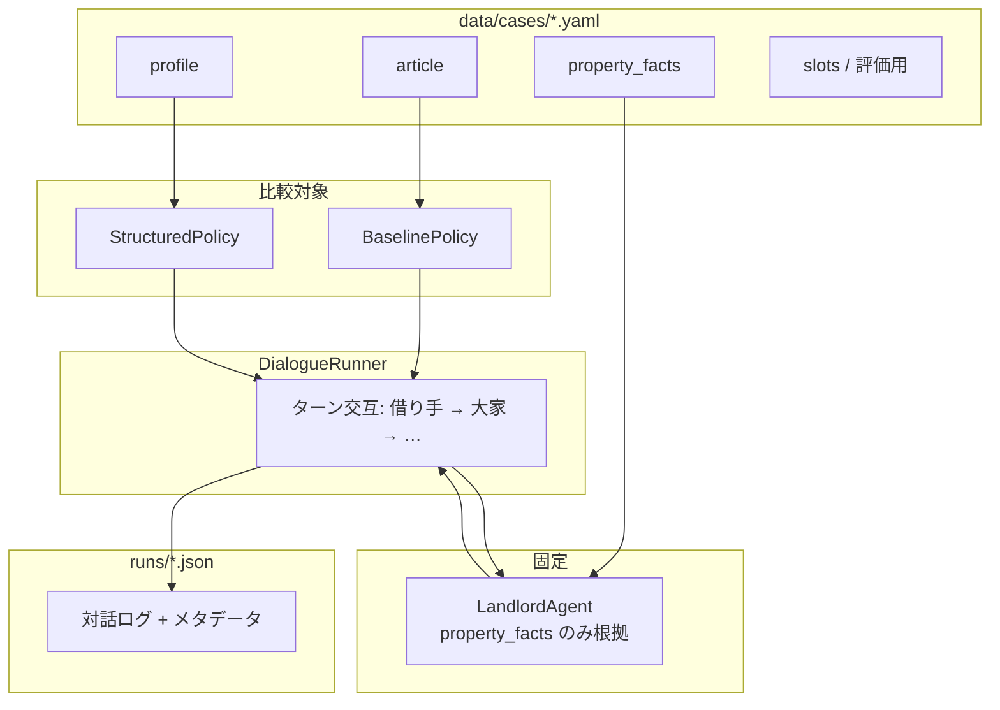

# 借り手AIエージェント実験システム 設計書

| 項目 | 内容 |
|---|---|
| 版 | v0.2 |
| 更新 | 2026-05-27 |
| 関連 | `研究方針.md`, `AGENT.md`, `スライド/0513研究テーマ仮発表/` |

---

## 1. 目的

逆さま不動産の文脈で、**借り手の記事に基づき大家と多ターン対話する借り手AI**を検討する。本システムは本番サービスではなく、次の研究仮説を検証するための **対話実験基盤** である。

> **記事をそのまま LLM に渡す（Baseline）より、目的・希望・制約・質問項目に構造化して渡す（Structured）方が、根拠忠実性とタスク達成が高くなるか。**

### 1.1 研究フレーム

逆さま不動産のモデルに基づき、**大家が1つの物件を持ち、複数の借り手候補がそれぞれ熱意を伝えながら物件について質問する**シナリオを想定する。借り手AIは「目的のアピール」と「物件についての確認質問」を自然に行いながら大家と対話する。

### 1.2 スコープ内

- ケース（借り手記事・構造化プロファイル・物件ファクト）に基づく多ターン対話の自動生成
- 借り手側の2条件（Baseline / Structured）の比較
- 大家側は **物件ファクトに根拠づく LLM**（全条件で同一設定）
- 対話ログの JSON 保存と人手評価のためのメタデータ

### 1.3 スコープ外（v0.2）

- 逆さま不動産プラットフォームとの本番連携
- Web UI・認証・DB
- 構造化の自動抽出パイプライン（v0.2 では手作りプロファイルで分離）
- LLM-as-judge による自動評価の本格運用
- 借り手・大家の完全自由対話（再現性・比較のため固定要素を設ける）

---

## 2. システムの全体像

### 2.1 一言で

**借り手AI（手法が2種類）と、物件ファクト固定の大家LLMが交互に話し、ログを残す実験装置。**

### 2.2 登場人物

| 役 | 実装 | 実験での扱い |
|---|---|---|
| **借り手AI** | LLM + 借り手用 system prompt | **比較対象**（Baseline vs Structured） |
| **大家LLM** | LLM + 物件ファクト + 大家用 system prompt | **全条件で固定**（事実・プロンプト・モデル同一） |
| **借り手記事** | YAML `article` | Baseline の根拠（記事全文） |
| **構造化プロファイル** | YAML `profile` | Structured の根拠（LLM補助＋研究者確認で作成） |
| **物件ファクト** | YAML `property_facts` | 大家が答えてよい事実の上限（完全架空・研究者作成） |

### 2.3 なぜ大家も LLM か

借り手AIは自由に質問するため、大家は質問内容に応じて答える必要がある。固定台本のみでは「聞かれていないセリフを読む」形になり、Task Success の検証ができない。

一方、大家を完全自由にすると大家側のぶれがノイズになる。**物件ファクトシートに厳格に grounding した大家LLM** とし、答えられる範囲を実験設計で固定する。大家LLMはLLMで質問の意図を解釈するが、出力は物件情報をシンプルに返すのみでよく、自然な会話文の生成は不要。

### 2.4 ブロック図



---

## 3. 対話フロー

### 3.1 ターン順序

1. **大家** が最初の挨拶・導入を発話（`opening` 固定文）
2. **借り手AI** が応答（アピール + 質問）
3. **大家LLM** が `property_facts` の範囲で応答
4. 2〜3 を `max_turns=6` まで繰り返す（往復6回）

`opening` は大家の0ターン目として扱い、ターンカウントに含めない。

### 3.2 終了条件

- `max_turns=6`（往復6回）に到達（v0.2 はターン数固定）
- `questions` がすべて一度は言及された（任意・v0.3）
- 評価用 `slots` がすべて埋まったと借り手が要約した（任意・v0.3）

### 3.3 シーケンス（例）

```
大家[opening]: こんにちは。どのような使い方をお考えですか？
借り手AI: 週末に小さな菜園を始めたいと考えています。庭や畑として使える面積はどのくらいでしょうか？
大家LLM: 庭は約30㎡あります。畑利用は要相談です。
借り手AI: 水道は使えますか？家賃と契約期間も教えてください。
大家LLM: 水道は使えます。家賃は月3万円、最低1年の契約です。
…（計6往復）
```

---

## 4. 実験条件（比較設計）

### 4.1 変えるもの（独立変数）

| 条件 ID | 借り手の system prompt | 根拠データ |
|---|---|---|
| `baseline` | 記事全文をそのまま埋め込み | `article`（記事全文） |
| `structured` | 目的・希望・制約・質問項目を明示 | `profile`（LLM補助＋研究者確認で作成） |

### 4.2 固定するもの（統制変数）

| 項目 | 固定内容 |
|---|---|
| 大家 LLM | `claude-haiku-3-5`、`temperature=0` |
| 大家 system prompt | `prompts/landlord.txt` 共通 |
| `property_facts` | ケースごとに同一（条件間で共有） |
| `opening` | 大家の初回発話（ケース YAML に固定文を記載） |
| 借り手 LLM モデル | `claude-haiku-3-5`、`temperature=0` |
| ケース ID | 同一 YAML で2条件を実行 |

### 4.3 研究上の注意

- **構造化の自動抽出** と **構造化プロファイルの利用** は別実験に分ける。v0.2 の Structured では `profile` を **LLM補助＋研究者確認で作成** し、「構造化して渡す効果」だけを見る。作成方法はケースの `meta.profile_created_by` に記録する。
- 大家 LLM も非決定的になりうるが、`temperature=0` で十分に安定させる。

---

## 5. データ設計

### 5.1 ケースファイル `data/cases/{case_id}.yaml`

```yaml
id: case01_garden
title: 週末菜園を始めたい借り手

# 借り手が公開している記事（Baseline の入力 / 記事全文をそのまま入れる）
article: |
  田舎の空き家で小さな菜園を始えたいと考えています。
  週末に通える距離なら嬉しいです。南向きで水が使える場所が理想です。
  …（記事全文）

# 構造化プロファイル（Structured の入力。LLM補助＋研究者確認で作成）
profile:
  purpose: 週末に小さな菜園を始め、空き家を活用したい
  wishes:
    - 南向きで日当たりがよい
    - 水道が使える
    - 自宅から車で1時間以内
  constraints:
    # 記事に存在しないが誤って言いやすい項目を明示（調整前提）
    - 家族構成・収入・詳細な予算額について記事にないため言わない
    - 記事にない設備の有無を断言しない
  questions:
    - 庭や畑として使える面積はどのくらいか
    - 水道・電気の状態はどうか
    - 家賃と契約期間はどうか
    - 周辺の生活環境（買い物・病院）の便りはどうか

# 大家が答えてよい事実（完全架空・研究者作成。10ケース全体でバリエーションを持たせる）
# 必須スロット項目には回答を用意し、特殊設備等は一部「要相談」にする
property_facts:
  garden_area: "庭は約30㎡。畑としての利用は大家と相談が必要"
  utilities: "水道は利用可能。電気は未接続で引き込み要相談"
  rent: "月額3万円"
  contract: "最低1年の定期借家契約"
  location: "最寄りスーパーまで車10分"

# 大家の初回発話（固定文。ケースごとに記載）
opening: "こんにちは。どのような使い方をお考えですか？"

# Task Success 評価用：借り手が自発的に聞き出すべき重要項目（4〜5項目・調整前提）
slots:
  - id: garden_area
    description: 庭・畑として使える面積または可否
  - id: utilities
    description: 水道・電気の状態
  - id: rent
    description: 家賃
  - id: contract
    description: 契約期間・条件

# 実験メタ
meta:
  domain: reverse_real_estate
  profile_created_by: "llm_assisted"   # "manual" | "llm_assisted"
  notes: "パイロットケース1"
```

### 5.2 ケース数と作成順序

- **現在:** Markdown形式で10件（`data/cases/*.md`）
- **今後:** 記事は増加予定。YAMLフォーマットで順次追加
- **作成順序:** 1本作成 → 手動対話確認 → フォーマット確定 → 残り順次作成

### 5.3 ログ出力 `runs/{case_id}_{condition}_{timestamp}.json`

```json
{
  "case_id": "case01_garden",
  "condition": "baseline",
  "model_borrower": "claude-haiku-3-5",
  "model_landlord": "claude-haiku-3-5",
  "temperature": 0,
  "max_turns": 6,
  "turns": [
    {"role": "landlord", "content": "こんにちは。どのような使い方をお考えですか？"},
    {"role": "borrower", "content": "…"},
    {"role": "landlord", "content": "…"}
  ],
  "slots_checklist": {
    "garden_area": { "mentioned": false, "evidence_turn": null },
    "utilities":   { "mentioned": false, "evidence_turn": null },
    "rent":        { "mentioned": false, "evidence_turn": null },
    "contract":    { "mentioned": false, "evidence_turn": null }
  }
}
```

`slots_checklist` は全スロットを `mentioned: false` で初期化してログに含める。人手評価時に評価者が直接 JSON を編集して `true` / `evidence_turn` を記入する。

---

## 6. コンポーネント設計

### 6.1 ディレクトリ

```
SourceCode/borrower_agent/
├── 設計書.md          # 本ファイル
├── .env / .env.example
├── data/
│   └── cases/         # 実験ケース YAML（+ 元記事 Markdown）
├── prompts/
│   ├── borrower_common.txt      # 両条件共通ルール
│   ├── borrower_baseline.txt    # Baseline 固有テンプレート
│   ├── borrower_structured.txt  # Structured 固有テンプレート
│   └── landlord.txt
├── src/
│   ├── models.py           # Case, Turn, RunResult
│   ├── llm_client.py       # Anthropic API 呼び出し
│   ├── borrower_policy.py  # Baseline / Structured
│   ├── landlord_agent.py   # property_facts grounding
│   └── dialogue_runner.py  # 多ターンループ
├── scripts/
│   └── run_experiment.py   # CLI エントリポイント
├── runs/                   # 生成ログ（gitignore）
└── eval/
    ├── rubric.md           # 評価基準
    └── scores.csv          # 人手スコア
```

### 6.2 クラス・責務

| モジュール | 責務 |
|---|---|
| `models.py` | YAML → `Case`、ログ用 `RunResult` |
| `llm_client.py` | Anthropic API 呼び出し、履歴の messages 組み立て |
| `borrower_policy.py` | `build_system_prompt(case) -> str` |
| `landlord_agent.py` | `reply(history, property_facts) -> str` |
| `dialogue_runner.py` | ターン管理、ログ保存 |
| `run_experiment.py` | `--case`, `--conditions baseline,structured` |

### 6.3 借り手ポリシー（インターフェース）

```python
class BorrowerPolicy(Protocol):
    condition: str  # "baseline" | "structured"

    def build_system_prompt(self, case: Case) -> str: ...
```

**Baseline**: `prompts/borrower_common.txt` + `prompts/borrower_baseline.txt` + `case.article`

**Structured**: `prompts/borrower_common.txt` + `prompts/borrower_structured.txt` + `case.profile` を整形

共通ルール `borrower_common.txt`（両条件で完全に同一）:

- 借り手役として大家と話す
- 与えられた情報にない事実は述べない
- 自然な日本語
- 適宜、目的のアピールと確認質問を行う

### 6.4 大家エージェント

```python
class LandlordAgent:
    def build_system_prompt(self, case: Case) -> str:
        # prompts/landlord.txt + property_facts の列挙

    def reply(self, history: list[Message]) -> str:
        # LLM で質問の意図を解釈し、property_facts の該当情報を返す
        # 回答は各質問に1文ずつ・箇条書きOK（自然な会話文は不要）
        # property_facts 以外の質問には「その点は確認が必要です」
```

### 6.5 DialogueRunner と role マッピング

`DialogueRunner` が `Turn(role, content)` の共有ログを保持する。`role` は `"borrower"` または `"landlord"`。

API 呼び出し時に呼び出し主体に応じて変換する:

- **借り手LLMへのリクエスト**: 大家の発話 → `user`、借り手の過去発話 → `assistant`
- **大家LLMへのリクエスト**: 借り手の発話 → `user`、大家の過去発話 → `assistant`

`opening` は大家の0ターン目として共有ログに追加し、ターンカウントには含めない。

---

## 7. プロンプト方針

### 7.1 大家 `prompts/landlord.txt`

- `property_facts` を箇条書きで埋め込む
- 質問の意図をLLMで解釈し、対応するfactsを返す
- 回答は **各質問に1文ずつ・箇条書きOK**（長文・自然な会話文は不要）
- `property_facts` に記載のない質問には **「その点は確認が必要です」** と答える
- 推測・補完・事実の創作を行わない

### 7.2 借り手 Baseline `prompts/borrower_baseline.txt`

- `borrower_common.txt` の後に結合
- `article` 全文を埋め込む
- 「この記事の人物として」ロールプレイの指示

### 7.3 借り手 Structured `prompts/borrower_structured.txt`

- `borrower_common.txt` の後に結合
- `purpose` / `wishes` / `constraints` / `questions` をセクション分けで埋め込む
- `constraints` を **禁止事項** として強調
- `questions` は「以下の質問リストのうち、まだ確認できていないものを優先して聞いてください」と指示（動的追跡なし・LLMに委ねる）

---

## 8. 評価設計

### 8.1 評価軸

| 軸 | 定義 | v0.2 の測り方 |
|---|---|---|
| **Faithfulness** | 記事から直接引用または言い換えできない新情報を述べていないか | 人手（ログ読解） |
| **Persona Consistency** | 借り手の目的・価値観と合っているか | 人手 |
| **Task Success** | `slots` の情報を大家から得られたか | 人手（slots_checklist を直接編集） |
| **Naturalness** | 会話として自然か | 人手（5段階） |

### 8.2 評価基準の詳細

**Faithfulness 判定基準:**
- 違反: 記事から直接引用・言い換えできない新情報を借り手AIが述べた場合
- 許容: 記事の文言を言い換えた表現（同義表現）
- `eval/rubric.md` にサンプル判定例を3〜5個記載して評価ブレを防ぐ

**Task Success 判定基準:**
- 大家が slot に対応する回答を返したターンを `evidence_turn` としてカウント
- 借り手が質問したのみで大家が未回答の場合はカウントしない
- 大家が `property_facts` 外の情報を答えた場合は「大家側の問題」として別記録

### 8.3 評価体制

- 評価者: 研究者本人1名（オープン評価）
- v0.2 はパイロット段階のため盲検化不要
- 発表用データ（P4）では条件名を除いたログ（`case01_1.json`/`case01_2.json`）で評価し、採点後に対応表を参照する

### 8.4 比較の見方

同一 `case_id` で `baseline` と `structured` のログを並べ、

- 記事外の事実（家族構成の捏造など）が減ったか
- `questions` / `slots` に対応する質問が増えたか
- 大家の回答は `property_facts` と矛盾していないか（大家側の品質チェック）

---

## 9. CLI（予定）

```bash
# 単一ケース・両条件
python scripts/run_experiment.py --case case01_garden --conditions baseline,structured

# 全ケース
python scripts/run_experiment.py --all-cases --conditions baseline,structured

# 大家のみテスト（実装後）
python scripts/run_experiment.py --case case01_garden --test-landlord-only
```

環境変数（`.env`）:

```
ANTHROPIC_API_KEY=sk-ant-...
ANTHROPIC_MODEL=claude-haiku-3-5
```

---

## 10. 実装フェーズ

| フェーズ | 内容 | 成果物 |
|---|---|---|
| **P0** | 1本目ケースYAML（LLM補助で作成）＋プロンプト3種（borrower_common/baseline/landlord）| 手動Claudeで1対話確認・フォーマット確定 |
| **P1** | `llm_client`（Anthropic API）, `landlord_agent`, 大家単体テスト | 大家が facts のみで答える |
| **P2** | `borrower_policy` Baseline, `dialogue_runner` | baseline ログ1本 |
| **P3** | Structured 条件, `run_experiment.py` | 2条件比較ログ |
| **P4** | 残りケース順次追加（記事増加に合わせて）, `eval/rubric.md` | 発表用例・簡易表 |

---

## 11. リスクと対策

| リスク | 対策 |
|---|---|
| 大家が facts 外を答える | temperature=0、「その点は確認が必要です」フォールバック明示、事前単体テスト |
| 借り手が質問しない | Structured で `questions` を明示、共通ルールに「確認質問を行う」を記載 |
| 2条件の差が大家のぶれで埋もれる | 大家 temperature=0、opening 固定、同一ケースで2条件実行 |
| 構造化の効果と抽出の効果が混ざる | v0.2 は profile をLLM補助＋研究者確認で作成（meta に記録） |
| API コスト | haiku から開始、品質問題があれば sonnet に切り替え |
| フォーマット変更が全ケースに波及 | 1本→確認→フォーマット確定→残り作成の順序を厳守 |
| 記事が増加した際の管理 | Markdown原文を `data/cases/` に残し、YAMLを同ディレクトリで管理 |

---

## 12. 用語集

| 用語 | 意味 |
|---|---|
| Baseline | 借り手記事全文をプロンプトにそのまま入れる条件 |
| Structured（Proposed） | 目的・希望・制約・質問項目に分けたプロファイルを使う条件 |
| property_facts | 大家が答えてよい物件情報の閉じた集合（完全架空・研究者作成） |
| slots | 借り手が聞き出すべき情報項目（Task Success 用・4〜5項目） |
| profile | 借り手側の構造化ペルソナ（LLM補助＋研究者確認で作成） |
| opening | 大家の初回固定発話（ターンカウント外・YAML記載） |

---

## 13. 変更履歴

| 版 | 日付 | 内容 |
|---|---|---|
| v0.1 | 2026-05-27 | 初版。大家を property_facts 固定 LLM とする方針を採用 |
| v0.2 | 2026-05-27 | 設計レビューにより全項目確定。主な変更: モデルをClaude系（haiku）に変更、article=記事全文、property_facts=完全架空、DialogueRunner共有ログ方式、borrower_common.txt 追加、評価基準の詳細化、P0作業順序の明確化 |
