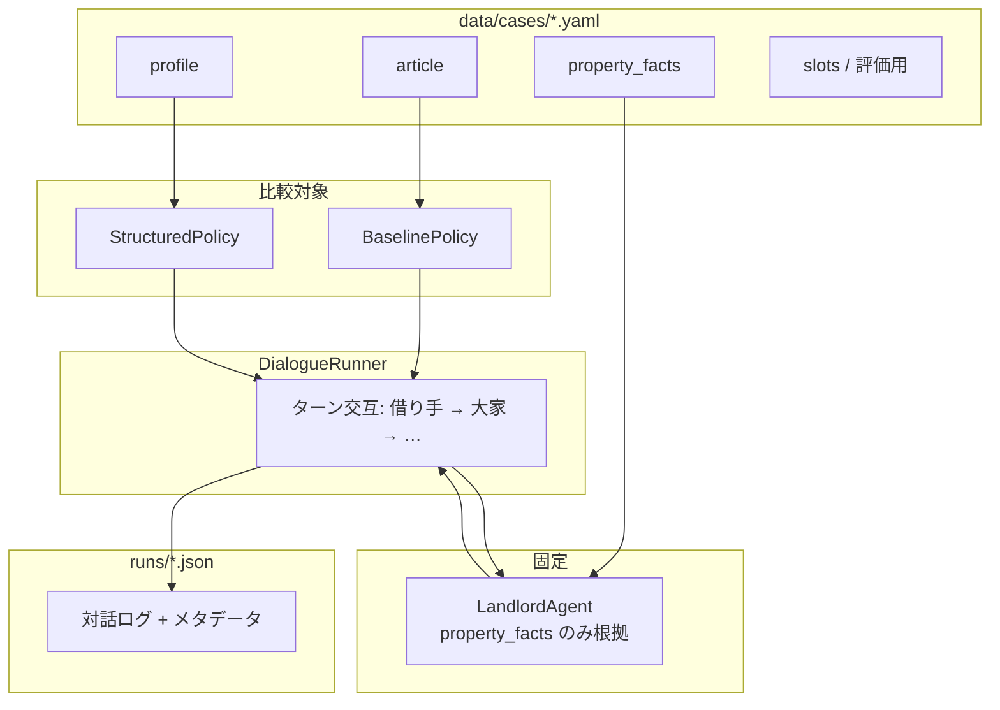

# 借り手AIエージェント実験システム 設計書

| 項目 | 内容 |
|---|---|
| 版 | v0.1（ドラフト） |
| 更新 | 2026-05-27 |
| 関連 | `研究方針.md`, `AGENT.md`, `スライド/0513研究テーマ仮発表/` |

---

## 1. 目的

逆さま不動産の文脈で、**借り手の記事に基づき大家と多ターン対話する借り手AI**を検討する。本システムは本番サービスではなく、次の研究仮説を検証するための **対話実験基盤** である。

> **記事をそのまま LLM に渡す（Baseline）より、目的・希望・制約・質問項目に構造化して渡す（Proposed）方が、根拠忠実性とタスク達成が高くなるか。**

### 1.1 スコープ内

- ケース（借り手記事・構造化プロファイル・物件ファクト）に基づく多ターン対話の自動生成
- 借り手側の2条件（Baseline / Structured）の比較
- 大家側は **物件ファクトに根拠づく LLM**（全条件で同一設定）
- 対話ログの JSON 保存と人手評価のためのメタデータ

### 1.2 スコープ外（v0.1）

- 逆さま不動産プラットフォームとの本番連携
- Web UI・認証・DB
- 構造化の自動抽出パイプライン（v0.1 では手作りプロファイルで分離）
- LLM-as-judge による自動評価の本格運用
- 借り手・大家の完全自由対話（再現性・比較のため固定要素を設ける）

---

## 2. システムの全体像

### 2.1 一言で

**借り手AI（手法が2種類）と、物件ファクト固定の大家LLMが交互に話し、ログを残す実験装置。**

### 2.2 登場人物

| 役 | 実装 | 実験での扱い |
|---|---|---|
| **借り手AI** | LLM + 借り手用 system prompt | **比較対象**（Baseline vs Structured） |
| **大家LLM** | LLM + 物件ファクト + 大家用 system prompt | **全条件で固定**（事実・プロンプト・モデル同一） |
| **借り手記事** | YAML `article` | Baseline の根拠 |
| **構造化プロファイル** | YAML `profile` | Proposed の根拠 |
| **物件ファクト** | YAML `property_facts` | 大家が答えてよい事実の上限 |

### 2.3 なぜ大家も LLM か

借り手AIは自由に質問するため、大家は質問内容に応じて答える必要がある。固定台本のみでは「聞かれていないセリフを読む」形になり、Task Success の検証ができない。

一方、大家を完全自由にすると大家側のぶれがノイズになる。**物件ファクトシートに厳格に grounding した大家LLM** とし、答えられる範囲を実験設計で固定する。

### 2.4 ブロック図



---

## 3. 対話フロー

### 3.1 ターン順序

1. **大家** が最初の挨拶・導入を発話（`opening` または LLM 生成1発目）
2. **借り手AI** が応答（アピール + 質問）
3. **大家LLM** が `property_facts` の範囲で応答
4. 3〜4 を `max_turns` まで繰り返す（目安: 借り手 4〜6 発話、大家 4〜6 発話）

### 3.2 終了条件

- `max_turns` に到達
- 借り手側の `questions` がすべて一度は言及された（任意・v0.2）
- 評価用 `slots` がすべて埋まったと借り手が要約した（任意・v0.2）

v0.1 では **ターン数固定** で十分。

### 3.3 シーケンス（例）

```
大家: こんにちは。どのような使い方をお考えですか？
借り手AI: 週末に小さな菜園を始めたいと考えています。庭や畑として使える面積はどのくらいでしょうか？
大家LLM: 庭は約30㎡あります。畑利用は要相談です。
借り手AI: 水道は使えますか？家賃と契約期間も教えてください。
大家LLM: 水道は使えます。家賃は月3万円、最低1年の契約です。
…
```

---

## 4. 実験条件（比較設計）

### 4.1 変えるもの（独立変数）

| 条件 ID | 借り手の system prompt | 根拠データ |
|---|---|---|
| `baseline` | 記事全文をそのまま埋め込み | `article` のみ |
| `structured` | 目的・希望・制約・質問項目を明示 | `profile`（v0.1 は手作り） |

### 4.2 固定するもの（統制変数）

| 項目 | 固定内容 |
|---|---|
| 大家 LLM | 同一モデル・`temperature=0`（または低値） |
| 大家 system prompt | `prompts/landlord.txt` 共通 |
| `property_facts` | ケースごとに同一（条件間で共有） |
| `opening` | 大家の初回発話（任意で固定文） |
| 借り手 LLM モデル | Baseline / Structured で同一 |
| ケース ID | 同一 YAML で2条件を実行 |

### 4.3 研究上の注意

- **構造化の自動抽出** と **構造化プロファイルの利用** は別実験に分ける。v0.1 の Proposed では `profile` を **人手で作成** し、「構造化して渡す効果」だけを見る。
- 大家 LLM も非決定的になりうるため、必要なら同一ケースを **seed 固定で2回** 実行し、安定性を確認する。

---

## 5. データ設計

### 5.1 ケースファイル `data/cases/{case_id}.yaml`

```yaml
id: case01_garden
title: 週末菜園を始めたい借り手

# 借り手が公開している記事（Baseline の入力）
article: |
  田舎の空き家で小さな菜園を始えたいと考えています。
  週末に通える距離なら嬉しいです。南向きで水が使える場所が理想です。

# 構造化プロファイル（Proposed の入力。v0.1 は手作り）
profile:
  purpose: 週末に小さな菜園を始め、空き家を活用したい
  wishes:
    - 南向きで日当たりがよい
    - 水道が使える
    - 自宅から車で1時間以内
  constraints:
    - 家族構成・収入・職業について記事にないため言わない
    - 記事にない設備の有無を断言しない
  questions:
    - 庭や畑として使える面積はどのくらいか
    - 水道・電気の状態はどうか
    - 家賃と契約期間はどうか
    - 周辺の生活環境（買い物・病院）の便りはどうか

# 大家が答えてよい事実（これ以外は答えない / 「確認します」）
property_facts:
  garden_area: "庭は約30㎡。畑としての利用は大家と相談が必要"
  utilities: "水道は利用可能。電気は未接続で引き込み要相談"
  rent: "月額3万円"
  contract: "最低1年の定期借家契約"
  location: "最寄りスーパーまで車10分"

# 大家の初回発話（固定推奨）
opening: "こんにちは。物件についてご質問があればお聞きください。どのような使い方をお考えですか？"

# Task Success 評価用：聞き出すべきスロット
slots:
  - id: garden_area
    description: 庭・畑として使える面積または可否
  - id: utilities
    description: 水道・電気の状態
  - id: rent
    description: 家賃
  - id: contract
    description: 契約期間・条件

# 実験メタ（任意）
meta:
  domain: reverse_real_estate
  notes: "パイロットケース1"
```

### 5.2 ログ出力 `runs/{case_id}_{condition}_{timestamp}.json`

```json
{
  "case_id": "case01_garden",
  "condition": "baseline",
  "model_borrower": "gpt-4o-mini",
  "model_landlord": "gpt-4o-mini",
  "temperature": 0,
  "turns": [
    {"role": "landlord", "content": "…"},
    {"role": "borrower", "content": "…"}
  ],
  "slots_checklist": {
    "garden_area": { "mentioned": true, "evidence_turn": 3 },
    "utilities": { "mentioned": false, "evidence_turn": null }
  }
}
```

`slots_checklist` は v0.1 では未実装でもよい（人手評価で代替）。

---

## 6. コンポーネント設計

### 6.1 ディレクトリ

```
SourceCode/borrower_agent/
├── 設計書.md          # 本ファイル
├── .env / .env.example
├── data/
│   └── cases/         # 実験ケース YAML
├── prompts/
│   ├── borrower_baseline.txt
│   ├── borrower_structured.txt
│   └── landlord.txt
├── src/
│   ├── models.py           # Case, Turn, RunResult
│   ├── llm_client.py       # OpenAI 呼び出し
│   ├── borrower_policy.py  # Baseline / Structured
│   ├── landlord_agent.py   # property_facts grounding
│   └── dialogue_runner.py  # 多ターンループ
├── scripts/
│   └── run_experiment.py   # CLI エントリポイント
├── runs/                   # 生成ログ（gitignore）
└── eval/
    ├── rubric.md           # 評価基準
    └── scores.csv          # 人手スコア
```

### 6.2 クラス・責務

| モジュール | 責務 |
|---|---|
| `models.py` | YAML → `Case`、ログ用 `RunResult` |
| `llm_client.py` | API 呼び出し、履歴の messages 組み立て |
| `borrower_policy.py` | `build_system_prompt(case) -> str` |
| `landlord_agent.py` | `reply(history, property_facts) -> str` |
| `dialogue_runner.py` | ターン管理、ログ保存 |
| `run_experiment.py` | `--case`, `--conditions baseline,structured` |

### 6.3 借り手ポリシー（インターフェース）

```python
class BorrowerPolicy(Protocol):
    condition: str  # "baseline" | "structured"

    def build_system_prompt(self, case: Case) -> str: ...
```

**Baseline**: `prompts/borrower_baseline.txt` + `case.article`

**Structured**: `prompts/borrower_structured.txt` + `case.profile` を整形

共通ルール（両方に含める）:

- 借り手役として大家と話す
- 与えられた情報にない事実は述べない
- 自然な日本語
- 適宜、目的のアピールと確認質問を行う

### 6.4 大家エージェント

```python
class LandlordAgent:
    def build_system_prompt(self, case: Case) -> str:
        # prompts/landlord.txt + property_facts の列挙

    def reply(self, history: list[Message]) -> str:
        # property_facts 以外の事実を作らない
        # 不明な点は「確認します」「記載の範囲では分かりません」
```

大家プロンプトの要点:

- あなたは物件オーナー（大家）である
- 以下の `property_facts` **のみ**を根拠に答える
- 書いていない数値・設備を推測しない
- 借り手の質問に直接答える

---

## 7. プロンプト方針（概要）

### 7.1 大家 `prompts/landlord.txt`

- `property_facts` を箇条書きで埋め込む
- 幻覚防止の明示（「推測禁止」「不明は不明と言う」）
- 1〜3文程度の簡潔な応答を推奨（長文抑制）

### 7.2 借り手 Baseline `prompts/borrower_baseline.txt`

- `article` 全文
- 「記事の人物として」ロールプレイ

### 7.3 借り手 Structured `prompts/borrower_structured.txt`

- `purpose` / `wishes` / `constraints` / `questions` をセクション分け
- `constraints` を **禁止事項** として強調
- `questions` は未確認のものを優先して聞くよう指示

---

## 8. 評価設計

### 8.1 評価軸（研究方針と同一）

| 軸 | 定義 | v0.1 の測り方 |
|---|---|---|
| **Faithfulness** | 記事/プロファイルにない・矛盾する発言がないか | 人手（ログ読解） |
| **Persona Consistency** | 借り手の目的・価値観と合っているか | 人手 |
| **Task Success** | `slots` の情報を大家から得られたか | 人手 + キーワードメモ |
| **Naturalness** | 会話として自然か | 人手（5段階） |

### 8.2 比較の見方

同一 `case_id` で `baseline` と `structured` のログを並べ、

- 記事外の事実（家族構成の捏造など）が減ったか
- `questions` / `slots` に対応する質問が増えたか
- 大家の回答は `property_facts` と矛盾していないか（大家側の品質チェック）

### 8.3 大家ログの検証

大家も LLM のため、実験前に **大家単体テスト** を行う。

- 各 `property_facts` キーについて質問 → 正しい事実が返るか
- 存在しない設備について質問 → 推測せず「不明」となるか

---

## 9. CLI（予定）

```bash
# 単一ケース・両条件
python scripts/run_experiment.py --case case01_garden --conditions baseline,structured

# 全ケース
python scripts/run_experiment.py --all-cases --conditions baseline,structured

# 大家のみテスト（実装後）
python scripts/run_experiment.py --case case01_garden --test-landlord-only
```

環境変数（`.env`）:

- `OPENAI_API_KEY`
- `OPENAI_MODEL`（借り手・大家共通、デフォルト `gpt-4o-mini`）

---

## 10. 実装フェーズ

| フェーズ | 内容 | 成果物 |
|---|---|---|
| **P0** | 設計書・ケース1本 YAML・プロンプト3種 | 手動 ChatGPT で1対話確認 |
| **P1** | `llm_client`, `landlord_agent`, 大家単体テスト | 大家が facts のみで答える |
| **P2** | `borrower_policy` Baseline, `dialogue_runner` | baseline ログ1本 |
| **P3** | Structured 条件, `run_experiment.py` | 2条件比較ログ |
| **P4** | ケース3〜5本, `eval/rubric.md` | 発表用例・簡易表 |

---

## 11. リスクと対策

| リスク | 対策 |
|---|---|
| 大家が facts 外を答える | temperature=0、プロンプトで禁止、事前単体テスト |
| 借り手が質問しない | Structured で `questions` を明示 |
| 2条件の差が大家のぶれで埋もれる | 同一ケース連続実行、初回発話固定、可能なら seed 固定 |
| 構造化の効果と抽出の効果が混ざる | v0.1 は profile 手作り |
| API コスト | ケース数・ターン数を抑える（パイロットは N=3〜5） |

---

## 12. 用語集

| 用語 | 意味 |
|---|---|
| Baseline | 借り手記事をプロンプトにそのまま入れる条件 |
| Structured（Proposed） | 目的・希望・制約・質問項目に分けたプロファイルを使う条件 |
| property_facts | 大家が答えてよい物件情報の閉じた集合 |
| slots | 借り手が聞き出すべき情報項目（Task Success 用） |
| profile | 借り手側の構造化ペルソナ（v0.1 手作り） |

---

## 13. 変更履歴

| 版 | 日付 | 内容 |
|---|---|---|
| v0.1 | 2026-05-27 | 初版。大家を property_facts 固定 LLM とする方針を採用 |
