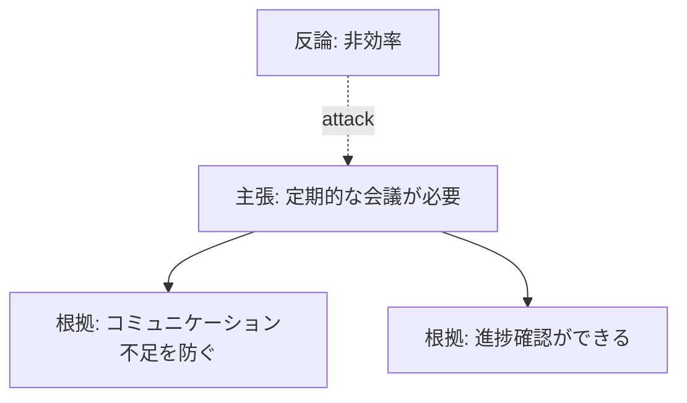

# 議論の可視化 (Discussion Visualization)

> タグ: #visualization #argument-mining #topic-shift

## 目的

議論の論理構造・流れを人間が直感的に把握できる形で表示する。

## 可視化の種類

### 論理構造の可視化
- **ツリー/グラフ表示**: 主張→根拠の階層構造をノード・エッジで表示
- **Argument Map**: 支持・反対関係を矢印で示す図
- **テキスト強調**: 主張・根拠を色分けして元テキスト中に表示

### 話題推移の可視化
- **色分けタイムライン**: 発言を話題ごとに色分けして時系列表示
- **類似度ヒートマップ**: 発言間のベクトル類似度を行列で表示
- **トピック境界マーカー**: 転換点を視覚的に強調

## 実装候補ツール

| ツール | 用途 | 出力形式 |
|--------|------|---------|
| **Marp** | スライド形式での議論フロー提示 | HTML/PDF |
| **matplotlib** | 類似度グラフ・ヒートマップ | PNG |
| **Mermaid** | Obsidianで描画できるフローチャート | SVG |
| **D3.js** | インタラクティブなArgument Map | Web |

## Obsidianでの活用

Mermaidはコードブロックとして`.md`ファイル内に埋め込めるため、wikiと統合しやすい：

## 我々の研究への接続

[[研究方針#仮説1]] のアウトプット形式として：
- プレ研究のStep3評価で可視化を使った定性評価
- 最終的なシステムのUI候補

[[研究方針#仮説2]] のアウトプット形式として：
- 発言の色分け表示（話題ごとに色を変える）
- 脱線時の警告表示

## 関連記事

- [[concepts/argument-mining]] — 可視化対象のデータ
- [[concepts/topic-shift-detection]] — 色分けの根拠となる分類
