

<!-- _paginate: false -->

# 会話ログの議論構造自動抽出と 話題変化の可視化

##  B3 福富隆大

---

## 無駄な議論をなくしたい

- 会議・ゼミのディスカッションが長時間化しても結論が出ないことがある
- **根本的な動機**：無駄な議論をしないようにしたい
  - 話が脱線していないか？
  - 同じ議論を繰り返していないか？
  - 誰かの意見が埋もれていないか？
- 「無駄か否か」を判断するには、議論の流れが見えていないといけない
- → 議論ログを**構造化・可視化**することで現状の把握が可能になる

---

## 提案手法の全体像

**目標**：LLMで議論の流れを見える化し、改善につなげるシステムを構築する

- 2つのアプローチ：
  1. **構造化**：会話ログをIBISモデルで自動分類（何が論点で何が提案・根拠か）
  2. **可視化**：話題の変化・脱線を埋め込みベクトルの距離で色表示

**主要な仮説**：
- 仮説A：LLMはIBISフレームワークに従い会話を正確に構造化できる
- 仮説B：埋め込みベクトルの距離は話題の転換点を反映する
- 仮説C：色の変化パターンから「脱線」「脱線→復帰」を区別できる

---

## システムの処理フロー

**入力テキスト → LLM（gpt-4o-mini） → ArgumentGraph → Embedding → 可視化**

- 2段階処理：
  1. 構造抽出（IBISノード・エッジの生成）
  2. 距離計算（埋め込みベクトル間のコサイン類似度 / ユークリッド距離）

---

## IBISモデルとは

IBIS = Issue-Based Information System

| ノード | 役割 |
|--------|------|
| **論点**（Issue） | 議論の中心となる問い |
| **提案**（Position） | 論点に対する回答・解決策 |
| **根拠**（Argument） | 提案を支持・反論する理由 |
| **決定**（Decision） | 合意に至った結論 |

---

## 入力：会話ログ（`A_normal.txt`）

<pre style="line-height: 2.0; font-size: 0.8em; background:#f6f8fa; padding:16px; border-radius:6px;">指導教員: 今日は卒論の提出スケジュールを確認したいと思います。現状を教えてください。
学生A: 第3章まで書き終わりました。今は第4章の実験結果の考察を執筆中です。
学生B: 私はまだ第2章が途中です。参考文献の整理に手間取っています。
指導教員: 締め切りまであと3週間です。優先順位をつけて進めましょう。
学生B: 参考文献は今週末に終わらせます。第3章の初稿は来週中に提出できます。
学生A: 私の第4章草稿は今週末にお送りします。
指導教員: 第4章の考察は、仮説とのズレも丁寧に書いてください。想定外の結果こそ論文の
核になります。
学生A: わかりました。「なぜ仮説と違ったのか」の原因分析を中心に書きます。
学生B: 参考文献、何件くらいが目安ですか？
指導教員: 20件以上は欲しいですね。質の高い国際論文を中心にしてください。
学生B: 了解しました。日本語論文だけにならないよう意識します。
指導教員: では、来週月曜日に二人の草稿を確認してフィードバックします。</pre>

---

## LLM出力：ArgumentGraph（`A_normal.txt`）

- **n1**（論点）= 卒論の提出スケジュール確認
- **n2**（提案）= 学生A：第3章まで書き終わった
- **n3**（提案）= 学生B：第2章が途中
- **n4**（根拠）= 締め切りまであと3週間
- **n5**（提案）= 学生B：参考文献を今週末に終わらせる
- **n12**（決定）= 来週月曜に草稿確認・フィードバック

エッジ例：`n1→n2`（提案）、`n4→n5`（支持）、`n1→n12`（決定）

---

## 例①：逸脱のない議論

  
ユークリッド距離 × 開始点から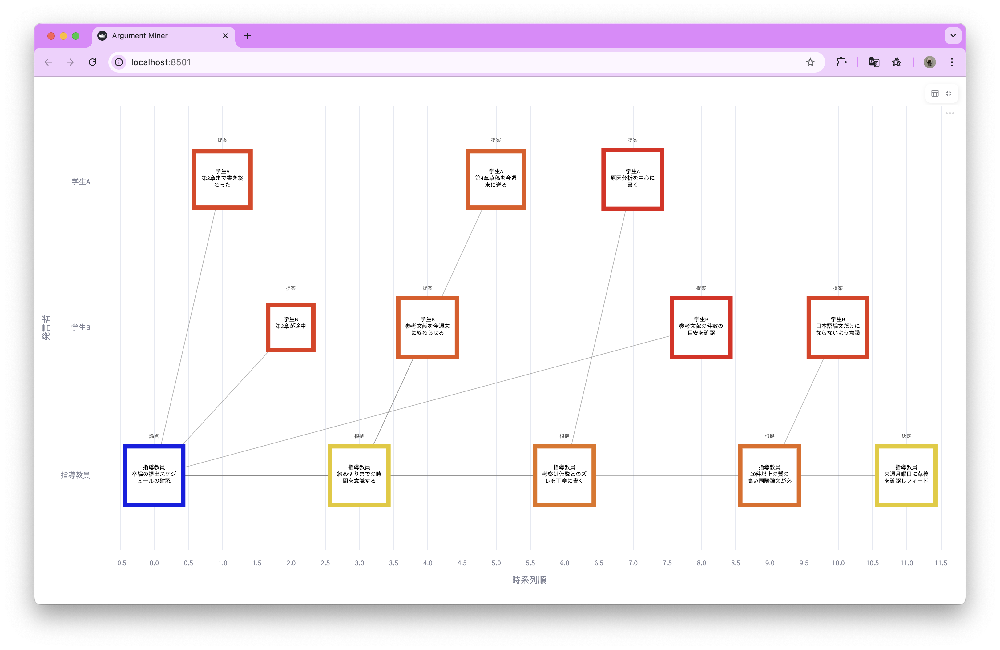

  
ユークリッド距離 × 直前との差分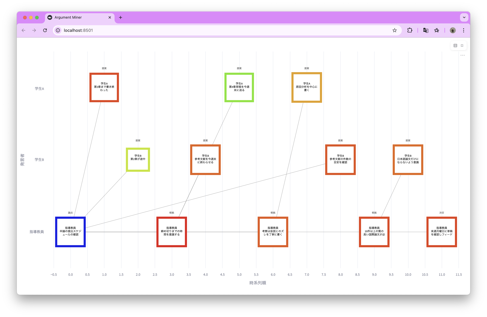

  
コサイン類似度 × 開始点から

  
コサイン類似度 × 直前との差分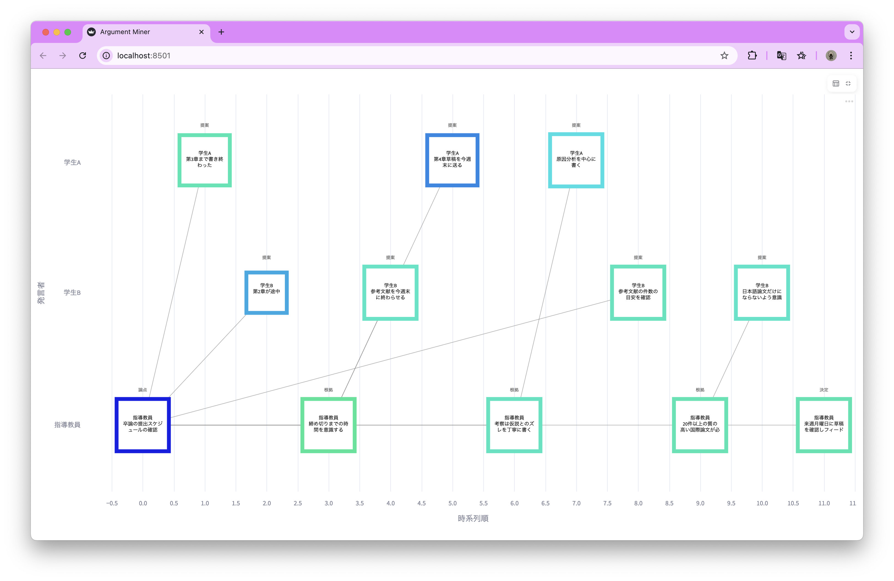

---

## 例②：脱線して戻らない議論

  
ユークリッド距離 × 開始点から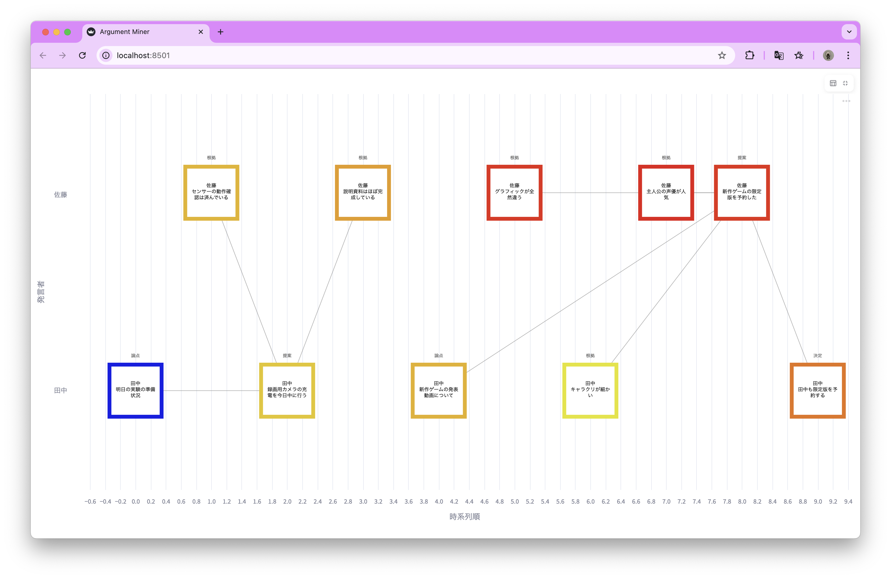

  
ユークリッド距離 × 直前との差分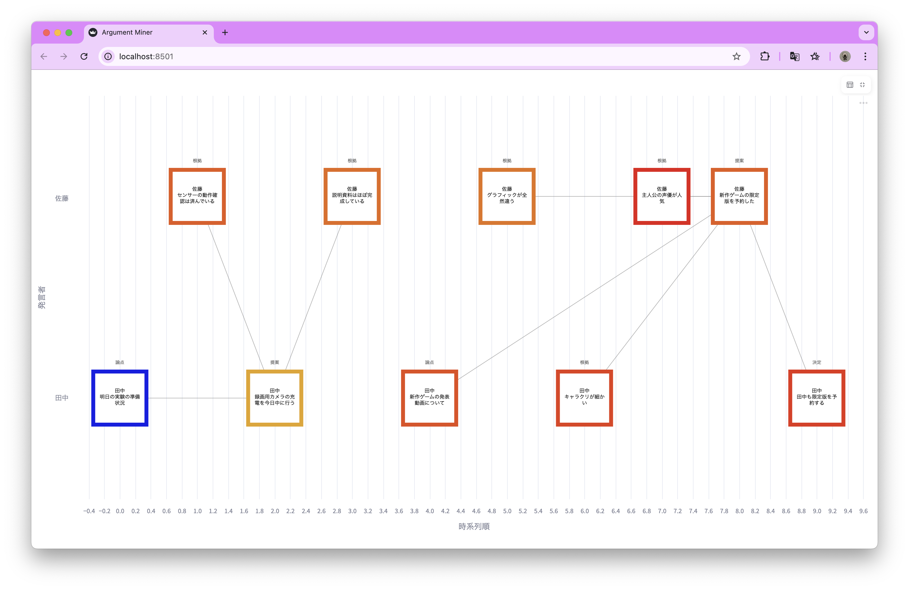

  
コサイン類似度 × 開始点から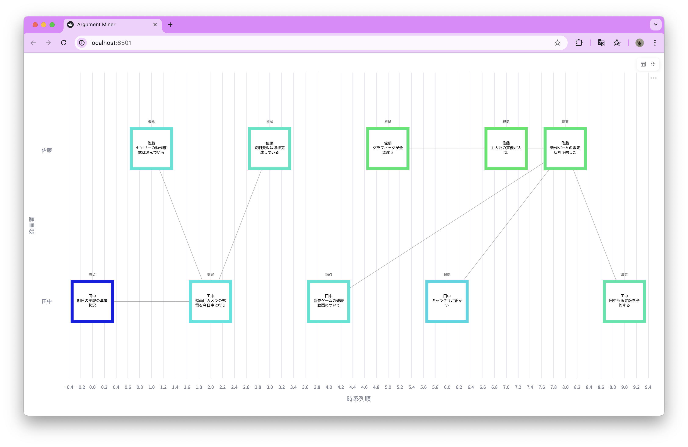

  
コサイン類似度 × 直前との差分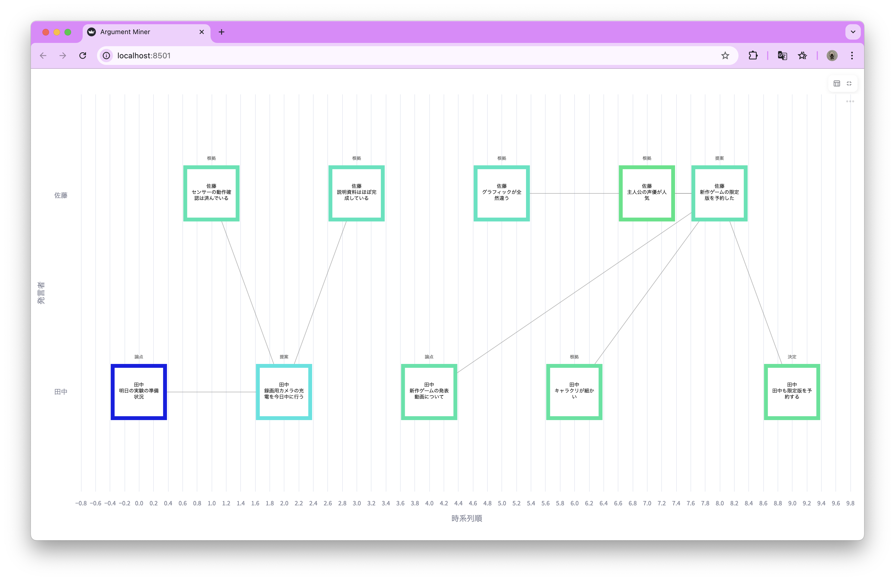

---

## 例③：脱線して戻ってくる議論

  
ユークリッド距離 × 開始点から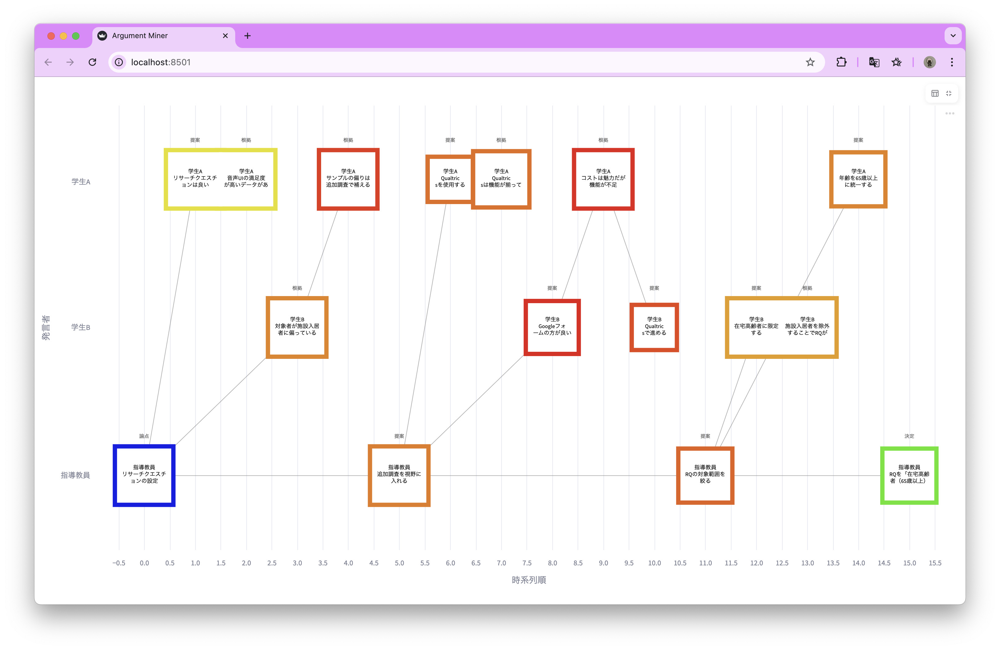

  
ユークリッド距離 × 直前との差分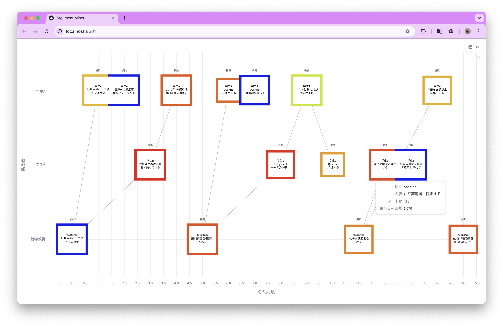

  
コサイン類似度 × 開始点から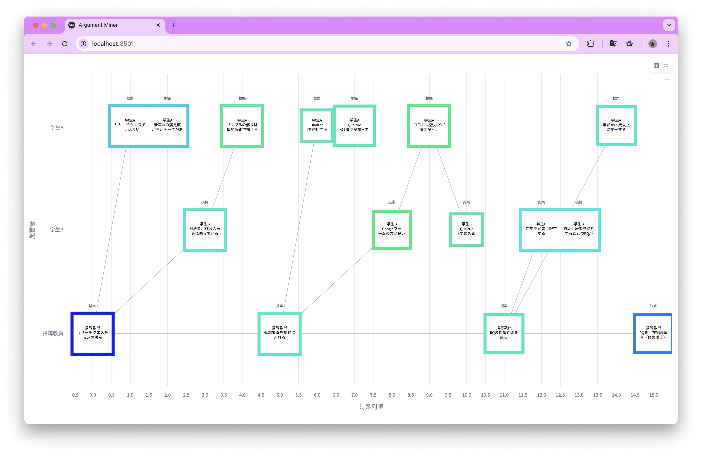

  
コサイン類似度 × 直前との差分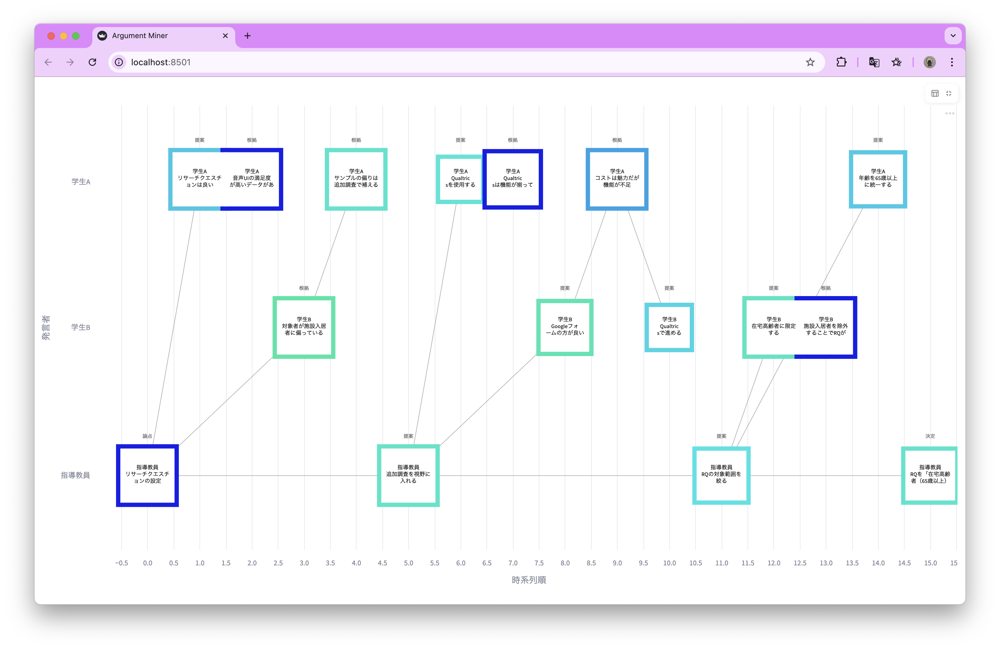

---

## 考察

| 仮説 | 内容 | 結果 |
|---|---|---|
| **A** | LLMはIBISに従い会話を正確に構造化できる | △ 概ね正確。ただし雑談など非論証的な発言は分類されない場合がある |
| **B** | 埋め込みベクトルは話題の転換を反映する | △ 話題の変化量に対してベクトルの変化が過大・過小になる場合がある |
| **C** | 色の変化パターンから「脱線」「脱線→復帰」を区別できる | ◯ A/B/Cの3パターンで色の変化が異なり、視覚的に区別できた |

- ユークリッド距離・コサイン類似度ともに同様の傾向が見られた
- LLMの誤分類があると埋め込み対象テキストが変わり、色表現に影響する

---

## 課題と今後の展開

- **配色の妥当性評価**：現在の色付けが直感的かどうかを検証する
- **長い議論への対応**：発言数が増えるとノードが密集して見にくくなる
- **リアルタイム整理**：議論の構造をリアルタイムで可視化する

